# 阿里 AI Native 研发范式实践手册


# AI Native 研发范式实践手册

AI-Native Software Engineering: A Practical Handbook

## 简介（Introduction）

过去两年，AI辅助研发经历了从“补全代码”到“自主交付”的范式转折。2024年中，行业的主流形态仍是Copilot——GitHub Copilot、Cursor、通义灵码等产品以IDE内嵌补全和对话为核心，解决的是单点编码效率问题。同年3月Cognition发布Devin，首次提出“AI软件工程师”概念，虽然实际能力有限，却将行业叙事从“辅助工具”拉向了“自主Agent”。

转折发生在2024年底至2025年上半年。Anthropic于2024年11月发布MCP（Model Context Protocol），为Agent连接外部工具建立了开放标准；2025年初Claude Code以CLI形态面世，将Agent Harness框架推向前台——Agent不再嵌入IDE等待指令，而是以“行动—验证—纠错”闭环自主推进任务。OpenAI随后推出Codex CLI，并在近期迭代至Multi-Agent V2，支持跨模型子Agent派发。Google的Gemini CLI、Jules，以及Cursor向Agent模式的转型，共同标志着行业从Copilot时代全面进入Agentic时代。

模型能力的进步为这一转型提供了基础。截至2026年中，主流模型在SWE-bench Verified上的通过率已从两年前的不足30%攀升至80%左右，在Terminal-Bench 2.1等更贴近真实工程的评测中，Claude、GPT-5.6 Sol、Qwen3等模型均突破85%。Coding能力正在被快速“解决”，行业共识也随之转移：瓶颈不再是生成代码本身，而是需求理解、环境构建、测试验证、发布运维等占据研发生命周期70%～80%的环节。

与此同时，企业级Agent基础设施成为新的竞争焦点。Anthropic于2026年5月推出Claude Managed Agents，提供托管的Agent运行时、自托管沙箱执行和MCP隧道，让企业无需自建基础设施即可将Agent投入生产；Microsoft Entra开始将Agent作为企业目录中的独立身份管理；MCP授权规范纳入OAuth 2.1；OWASP专门整理了Agentic AI威胁模型。Agent的运行环境、身份与权限体系、可观测与评测能力，正在从可有可无变为规模化落地的刚需。

**在阿里巴巴，我们选择积极投身这场变革，我们认为LLM和Agent带来的变革对于软件工程来说几乎是史无前例的。**从软件工程效率提升的角度，可能只有高级编程语言带来的变化可以与之相提并论，而在这种情形下，唯有积极投身其中才有可能真正理解这一变革的路径和意义。事实上大家也是这么去做的，我们积极引入内外部的各种模型和工具，鼓励工程师在真实的业务中去用全新的范式工作；我们鼓励大家打破岗位和团队的边界，让知识更透明、流动更快，让有价值判断的工程师自主决策，并看到一大批“超级个体”的涌现；我们成体系地面向Agent重新设计基础设施，不断打破Agent完成成长程任务所遇到的各类障碍，并看到Agent从完成代码编写开始，在不断接近能够自主完成复杂软件交付的目标。

当然这一切离不开行业的整体长足进步，尤其是模型能力的持续飞跃以及Harness框架的演进。但是仅仅依赖模型能力的自然溢出显然不够，因为我们认识到从模型及Harness框架的能力，到像阿里巴巴这样的大型企业的研发效能10x提升，中间存在着非常大的gap，具体来说主要在三个方面：

1.企业是否建设了一套完整的Agent基础设施以支持Agent安全可靠地访问操作各类内部系统。
2.企业是否通过重塑工作流（例如编写大量可靠的Skill）、整理历史知识，让Agent能够访问到围绕目标的清晰上下文。
3.企业是否重塑了组织文化、人才画像及激励机制、团队协同模式，以支撑个体和团队发挥10x的效能。这个问题对于个体来说演进路径是比较清晰的，对团队来说会非常复杂。

带着上述问题，我们首先从三个真实的业务实践案例出发，分别是AIDC数字投手智能营销助手、千问用增Agent和万有无界平台，呈现不同团队研发范式演进路径中的实际探索与反思。随后，我们从这些案例中提炼出五个共性挑战：环境与验证驱动、平台能力升级、提效度量、数字员工和组织配套，尝试回答研发流程、协作方式和组织设计层面正在发生的结构性变化。最后，我们会进一步展开企业级AI研发基础设施的技术全景：从Harness框架、企业知识库、工具体系（MCP／Skill／CLI），到Sandbox与Coding环境、身份与权限、生产安全Guardrail以及可观测能力，进而阐述让Agent从“能写代码”走向“可靠交付”所需要的系统性工程建设。

<!-- 第4页：装饰插图页（Agent/SOP/Skill/Memory 立体图标），无正文 -->

## 目录（Contents）

- 一、研发范式实践案例 …… 01
  - 1.1 案例一：AIDC数字投手智能营销助手 …… 01
  - 1.2 案例二：千问用增Agent …… 06
  - 1.3 案例三：万有无界平台 …… 10
- 二、实践中的挑战 …… 15
  - 2.1 挑战一：环境与验证驱动难题 …… 16
  - 2.2 挑战二：平台能力亟须升级 …… 20
  - 2.3 挑战三：度量，AI是否真的带来了提效 …… 22
  - 2.4 挑战四：数字员工如何实现自主性 …… 27
  - 2.5 挑战五：组织能力如何配套 …… 29
- 三、企业级AI研发基础设施 …… 33
  - 3.1 企业级Agent Harness …… 35
    - 3.1.1 核心运行机制 …… 35
    - 3.1.2 企业知识库 …… 39
    - 3.1.3 Agent工具体系：MCP、Skill与CLI …… 41
  - 3.2 Agent运行环境 …… 43
    - 3.2.1 Sandbox …… 43
    - 3.2.2 Coding环境 …… 47
  - 3.3 Agent可信与安全 …… 51
    - 3.3.1 Agent Identity & Policy …… 51
    - 3.3.2 Guardrail——安全生产 …… 55
  - 3.4 Agent可观测 …… 59
    - 3.4.1 可观测核心能力 …… 60
    - 3.4.2 架构 …… 61
- 四、总结 …… 62

# 一、研发范式实践案例

## 1.1 案例一：AIDC数字投手智能营销助手

### 背景

AIDC数字投手产品负责为Alibaba.com商家提供一站式广告服务。在业务层面，团队提供丰富的流量产品，包括效果广告（标准推、全站推）与品牌广告（问鼎、鼎展）；在技术层面，团队承接广告投放全流程能力建设，覆盖广告主后台（物料供给）、广告引擎（竞价排位）以及广告结算（点击计费）等核心环节。

随着AI浪潮到来，越来越多业务场景开始显现AI应用价值。为探索AI在国际广告业务中的落地，团队组建了一支6人小队，并发起数字投手专项。项目愿景是打造贴近客户诉求、具备丰富代操经验的“数字投手”，能够自动诊断广告效果问题、实时优化投放策略，以Agent能力提升客户广告运营效率。

围绕这一愿景，团队设定了如下目标：

1.业务提升：客户愿意用，用后效果好，业务留存提升。
2.产品建设：经验丰富，身手敏捷，头脑灵动的数字投手。
3.组织提效：人负责决策、智能体干活，高效业务Loop。

当然，团队面对的是这样一个起点：

1.经过3年的产品迭代与运营，广告诊断服务已形成客户使用和建议反馈机制，为后续智能化能力建设提供了实践基础。
2.平台有多套诊断服务：基于工作流的专家策略＋行动服务；基于ReAct Agent的对话式的咨询服务；基于向量库＋Workflow Agent的快问快答服务。此时数字投手并没有一个技术聚合体，还是偏产品定义的概念。
3.项目组产研人员比例是1:1，协作分工泾渭分明：PD负责业务分析与产品设计，研发负责项目交付和系统运维，各自都有数据分析的能力，但获取指标时，经常需要相互依赖。

### 效能破局

专项团队在组织提效方面做了比较多的尝试。这里经历了三个时期：超级个体、数字员工和云上Scrum。

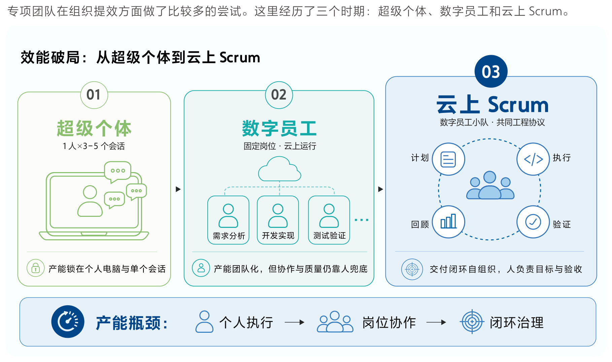

**超级个体期：**试用多种Coding Agent后，团队统一使用一款主流Agent工具。在熟悉工具后，单人指挥3～5个会话工作是常态，在夜间也能完成部分长程任务的交付（策略生产、数据分析、知识整理）。体感上一人能干出原来两到三人的活，初期很好地帮团队完成首版的MVP交付。但我们后续发现，这样的模式经常会出现一些尴尬情况：

- 消化障碍：团队通过消耗大量Token产出中间产物，但产物的理解、评审和应用很难靠人完成，经常出现的情况是，和同事沟通方案时，同事也讲不清设计，只能把问题抛给Agent；
- 复用障碍：在完成任务交付后，一个会话中通常沉淀了大量有价值的知识，如代码梳理、数据分析、工作流程，靠Skill做团队级复用并不容易，最高效的反而是直接保留这个会话与工作区，但彼时不具备通信基建。

本质上，Token放大的是一个人能干的事，产能还锁在个人电脑和单个会话里，难以被团队协作和继承。

**数字员工期：**今年6月，公司内部提供云端智能体运行时，我们将本地会话改造成可自验证、可并行、可推进流程的数字员工，覆盖产品、研发、评测和数据分析。它们按统一结构输出，成员可直接阅读、讨论和接手；人的职责转为设定目标、提供输入和验收结果，实现每周多次交付。个人产能第一次变成团队级产能，但新的问题也冒了出来：

- 岗位孤立：数字员工各有角色，但串任务要靠我们人肉当调度员，它们撑不起一条完整的交付闭环；
- 质量不稳：产物质量随任务和模型波动，缺少统一的校验标准，花在验收上的功夫不比执行省下的少；
- 任务认领：新任务进来，没有谁主动认领，分配和优先级还是要人来点名，大部分卡点需要人解决。

这个阶段一句话总结是：员工有了，但卡在协作上，人更多是传令兵。

<!-- 装饰插图（AI头像与界面立体图形），无正文 -->

**云上Scrum：**今年7月在与集团其他团队交流时，团队已经有了Agent协作工具，马上意识到数字员工要有自己的“钉钉”。随后自建了人机沟通专线，按业务域组织数字员工，支撑不同产品能力供给。这一时期典型场景就是专家策略供给与操作能力工具，团队开足马力完成了后续八成能力的交付与优化工作。我们将这一模式命名为“云上Scrum”。它像敏捷迭代一样，数字员工各司其职，但是不同于人类：它们不需要排期，因为来了活即可起线程干；也不用开日会，因为协作卡点随时沟通；也不需要总结会，因为每个任务完成后都有反思，再犯错的概率不高。这个阶段，团队成员的主要工作反而收拢到两个事情上：

- Loop维护：主要集中在环境与验证问题，代码开发需要有对应的测试执行，数据开发有对应的数据校验，产品验收对应评测报告；
- 寻找真需求：关键是找到业务增长的卡点，提出现阶段收益最大的需求，我们进一步建设增长预估的工具，能够大致评估出，某个需求落地预期对关键指标的提升幅度。

### 业务破局

业务提升上，团队的思路是：先做产品基建，再做好数据闭环。

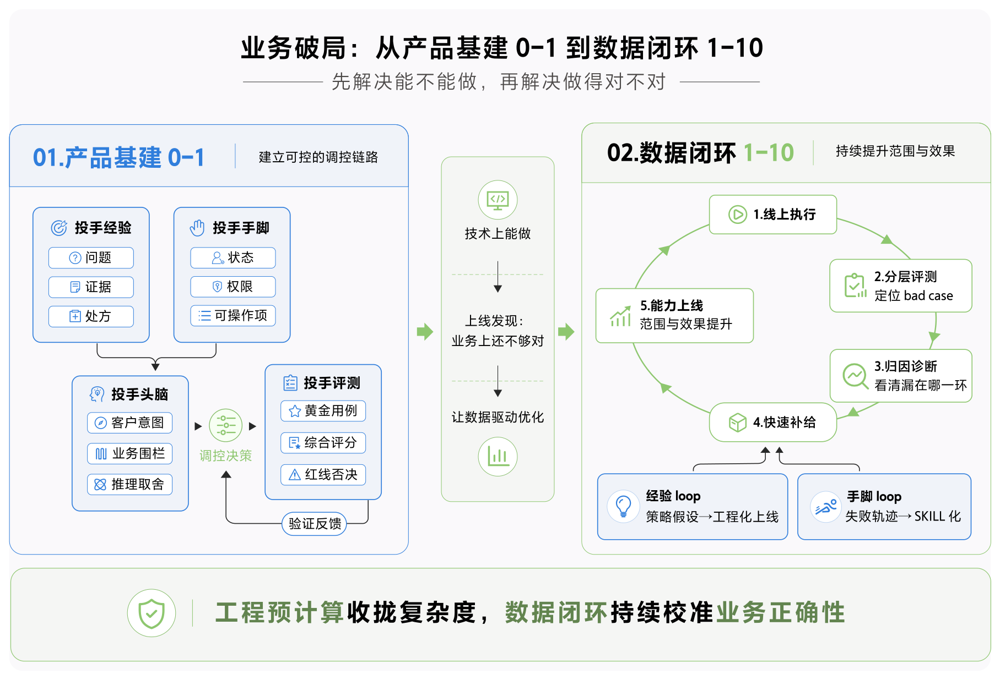

**产品基建：从0到1搭建可控的数字投手架构**

项目初期，团队没有采用纯ReAct模式构建数字投手。原因在于，Agent擅长推理，但“能推理”并不等于“可控”，而广告投放场景对确定性、可解释性和执行安全都有很高要求。因此，团队从一开始就围绕“如何约束Agent的自由度”进行设计，将数字投手拆解为“经验、手脚、头脑”三个相对独立的组件，并通过统一评测体系验证整体效果。

1.**投手经验**：将数据与运营沉淀中的专业经验提前提炼为结构化结论，包括“存在什么问题、证据是什么、建议采用什么处方、在什么条件下成立”，再提供给投手头脑。这样，头脑无需在运行时重新研究问题，而是直接基于专家结论进行决策。
2.**投手手脚**：屏蔽广告后台操作的复杂性，将状态、权限、参数约束等信息交由最接近事实的系统提前计算，并向头脑提供一份明确的可操作清单，包括“当前可以做什么、需要满足什么条件、失败后如何恢复”。头脑不再需要猜测参数与系统限制。
3.**投手头脑**：综合投手经验、可执行能力、客户意图以及预算、风险等业务围栏进行推理和取舍，只在预先限定的可控空间内执行操作，同时保证决策过程可解释，能够说明“为什么做出这一选择”。
4.**投手评测**：通过统一评测体系判断数字投手是否达到业务要求。评测以黄金用例作为测试集，以广告综合评分表作为统一标准，并由多个评测专家从不同视角进行评分；对于反向操作、数据错误等红线问题，则采用一票否决机制。

这套设计的本质，是通过**预计算与工程收口提升Agent产出的可控性**。投手头脑只需要关注当前问题、专家建议和可操作项，而将复杂计算、系统约束和执行细节下沉至工程系统，最终产出既符合业务约束、又能够真实执行的调控决策。

但项目上线后，团队发现实际调控效果仍低于预期。复盘后意识到，这套原则上成立的技术架构主要解决了“能不能做”的问题，却没有充分解决“业务上做得对不对”的问题。

**数据闭环：从1到10驱动策略持续进化**

在已经具备完整交付链路的基础上，团队进一步复盘发现，真正的问题在于数据仍然没有被充分看清、用透。因此，项目迅速调整方向，将重点从“完善能力”转向“建立数据闭环”，让线上数据持续驱动策略、能力与执行效果优化。

团队首先围绕线上执行漏斗建立评测体系，逐层判断**预检、策略、决策、围栏和执行**是否有效，并依据结果快速定位问题：如果是漏斗环节存在短板，则直接修复对应能力；如果基础链路正常，则进一步优化策略处方与行动组合。

围绕这一闭环，团队建设了两条云上Scrum供给线：

1.**经验Loop**：将策略挖掘与策略生产拆分给两个数字员工协同完成。一个数字员工负责从线上数据和业务问题中发现策略假设，另一个负责将策略假设工程化并上线，两者通过结构化契约完成交接。由此，策略交付周期从原来的约10天缩短至2天，实现从策略发现到工程上线的一条龙交付。
2.**手脚Loop**：将线上失败轨迹直接转化为能力建设需求，对问题进行聚类、定位根因、补齐能力、回归评测，再由人工完成最终发布，新产生的线上轨迹继续回流到下一轮迭代。通过数字员工参与能力生产，约80%的核心能力实现Skill化，并显著提升复杂任务场景下的服务成功率。

通过这两条Loop，项目最终形成了“线上执行→数据评测→问题定位→快速修复→新策略／新能力上线→再次执行”的持续循环，不断扩大诊断与行动覆盖面，并推动广告投放效果持续改善。

<!-- 装饰插图（环形图标），无正文 -->

### 反思

团队对AI Native的理解，并不是追求“无人化”，而是重新划分系统、AI与人的职责边界：系统负责状态、权限、规则等高确定性事务，确保执行边界稳定可靠；AI负责分析、生成以及跨步骤的长程执行，在约束范围内提升效率；人则继续负责目标设定、关键决策、风险取舍和最终责任。随着交付Loop稳定运行，这种分工开始直接改变团队协作方式：产品与研发之间的传统边界逐渐淡化，交付单元也从“人和人之间协作完成任务”，转向“人定义目标与验收标准、数字员工分工执行”。与此同时，传统以人日为中心的排期逐渐退出主流程，协调成本并没有消失，而是从“谁来做、需要几天”转移到了目标定义、任务拆解、验证标准以及发布门禁等更高价值的环节。

在实践中，团队逐渐形成了几条稳定原则：确定性的部分尽量交给工程，推理只发生在可控空间内；与其不断堆叠Skill，更应该沉淀可复用的工作流；评测从最小可用集开始，再根据真实业务持续补充。同时，数字员工并不能替代组织共识，它更适合高质量执行那些已经被想清楚、形成明确标准的工作。真正决定协作效率的，不只是模型能力，而是任务是否被定义清楚、边界是否明确、结果是否可验证。

这套模式仍有明确边界。当前增长机会的发现仍然高度依赖人的业务理解和数据洞察，系统尚不具备稳定判断“下一件最值得做的事情是什么”的能力；优秀计划占比等过程指标虽然随着闭环建设持续提升，但这些改善能否进一步转化为客户留存和长期商业价值，还需要通过统一的归因账本与严格实验方法验证。同时，数字员工虽然已经能够承担越来越长的执行链路，但目标设定、业务门槛定义、发布门禁以及高风险决策仍然需要人承担。因此，当前阶段AI Native更准确的形态并不是“AI替代人”，而是把执行权逐步交给AI，把判断权和责任留在人手中，并通过工程系统明确两者之间的边界。

<!-- 装饰插图（代码括号立体图形），无正文 -->

## 1.2 案例二：千问用增Agent

### 背景

千问用增Agent是由千问研发团队负责，其项目目标是用Agent重构用户增长体系，打造一套用户增长投放的工业化智能运营系统。

该Agent覆盖投放执行、投放策略、数据分析、预算规划、素材生产等模块。从业务角度看，其核心目标是提升用户增长运营效率、运营效果，带动目标产品的用户规模增长，这也是衡量系统成功与否的唯一目标；从研发角度看，其目标是利用AI／Agent重构传统开发流程，以提升开发效率。

千问用增Agent项目由以下5种岗位角色构成：

| 角色 | 主要职责 |
| --- | --- |
| 用户增长运营 | 提供领域知识、运营规则和异常场景；同时也是最终面向的用户 |
| 产品负责人 | 将业务目标转为场景、流程和验收条件 |
| 全栈工程师 | 对单个需求从设计到上线负责，包括Agent工程师；均由原服务端开发团队承接 |
| 数据工程师 | 负责数据口径、指标语义、数据质量和查询能力 |
| 质量工程师 | 负责测试系统功能、自动化验证、准入门禁 |

### 三阶段实践

千问用增Agent项目推行全栈AI Coding，覆盖前端、服务端、Agent Harness和算法策略。经过三个多月实践，项目大致经历了三个阶段：先验证AI Coding能否显著提升开发效率，再解决存量工程中的适配问题，最后逐步扩展到更完整的软件研发流程。

**第一阶段：粗放探索与能力验证。**项目从0到1建设初期，约15名服务端工程师分别探索AI Coding，并通过每周分享持续沉淀实践经验。这个阶段最明显的变化是代码生产效率大幅提升，服务端团队开始跨越原有岗位和技术栈边界，同时承担前端、服务端和Agent开发，实现了跨岗位、跨语言的“破界”开发。在方案设计、编码和测试等环节，AI均能带来明显提效，部分场景下代码生成速度可达到传统方式的数倍甚至约10倍。研发范式也随之变化，从“人理解需求后直接编码”，逐步转向“将需求和技术方案转化为Agent可理解的文档与工程规则→AI Coding→人工验证→人工发布”，团队开始有意识地沉淀项目级规则和上下文。

**第二阶段：标准化与存量工程适配。**随着项目完成 0 到 1 建设，单纯依赖代码生成带来的边际收益开始下降。团队发现，真正困难的问题不再是 AI 会不会写代码，而是如何让 AI 在已有代码库中准确理解项目结构、业务需求和工程约束，并稳定地产出高质量代码。因此，这一阶段的重点从追求生成速度转向方法标准化：一方面推广第一阶段形成的有效实践，另一方面持续修正其中不适用于复杂存量工程的方法，使 AI Coding 从个人技巧逐渐转化为团队可复用的研发能力。

**第三阶段：提升 SDLC 覆盖度并持续完善。**随着模型能力、工具链和团队实践不断成熟，AI Coding 开始从“编码工具”进入更完整的研发流程，逐步参与需求理解、方案设计、任务拆解、编码实现、联调自测、问题排查和文档沉淀。与此同时，随着系统代码框架逐渐成熟，单纯依靠生成代码获得的效率增益继续下降，工程建设的重点开始转向组织上下文、明确边界和建立验证机制。

团队进一步认识到，当前真正限制交付效果的，往往不是模型是否具备编码能力，而是它能否正确理解项目和需求、遵守工程边界，并在出现问题时自主排障。由此可以抽象出一组递进关系：如果项目理解不准确，需求描述再详细也可能走错方向；如果边界不明确，代码写得越快，潜在风险反而越大；如果缺乏测试和线上证据，就无法判断一次成功究竟是稳定能力，还是偶然结果。

### 实现可靠交付

面对这些问题，团队进一步将 AI Coding 的工程能力聚焦到四个环节：项目理解、需求理解、可靠编码和线上排障。目标不再只是提升代码生成速度，而是让 AI 能够基于真实项目上下文、明确需求和可验证反馈，持续完成复杂研发任务。

第一，解决“AI 如何快速理解项目”的问题。团队构建了可按需读取的项目文档与代码知识图谱，降低每次新会话重复寻找模块、搜索调用链的启动成本。其中，Code Docs 用于解释模块职责、设计背景和使用方式，Code Graph 用于精确查询代码定义、调用关系和影响范围，Rules 则将团队经验固化为可执行约束。文档解决“为什么这样设计、应该如何寻找”，代码图谱解决“具体在哪里、谁调用谁、改动会影响什么”，二者结合，使 Agent 能够从业务语义快速定位到具体代码。

第二，解决“AI 如何准确理解需求”的问题。团队不再假设需求描述已经完整，而是让 AI 主动追问其中隐含的业务和技术决策，并将确认结果沉淀为可追溯的 Spec 和 Tasks。因为人在写需求时往往会省略权限边界、并发处理、幂等策略等默认知识，而 AI 缺少这类组织记忆，只能猜测或忽略。例如，“生成公开分享链接”这一简单需求，背后实际涉及撤销机制、访问控制和数据一致性等多个决策。团队通过前置澄清，在开发成本最低的阶段暴露风险，再将结果转化为明确的验收标准和任务拆解，使每项实现都可以回溯到具体需求和决策。

第三，解决“AI 如何高效且可靠地编码”的问题。团队引入 TDD，将“代码是否正确”转化为可观察、可重复的执行反馈。流程上先用失败测试固定需求边界，再通过最小实现使测试通过，最后在测试保护下完成重构。实践中发现，可靠性往往不是单点问题，例如并发场景下 Agent 沙箱重复创建，真正需要保证的不只是接口层幂等，还包括请求入口、数据库事务、消息发布和消费执行等多个环节共同形成的链路幂等。因此，测试重点覆盖需求边界、关键分支和已知故障模式，而不是单纯追求覆盖率。这些实践进一步被沉淀为可复用工作流，使新的项目事实和经验能够持续回写，为下一轮 Agent 提供更完整的上下文。

第四，解决“AI 如何快速定位线上问题”的问题。团队通过统一 TraceId 打通日志、上下游状态与代码调用关系，并将排障过程沉淀为标准化诊断能力。排障不从猜测根因开始，而是优先收集 TraceId、结构化日志、上下游状态、代码位置和调用关系等事实证据，再基于完整请求链进行判断。对于明显错误，诊断 Agent 可直接基于日志快速定位；如果证据不足或状态存在矛盾，则将已有证据交给具备完整代码上下文的 Agent 继续分析。通过固定证据采集方式、升级条件和结论格式，线上排障逐渐从依赖个人经验转向可复用、可验证的工程流程。

这四类能力会不断沉淀为长期资产，包括项目文档与代码图谱、需求与验收场景、任务与测试结果，以及线上证据链和诊断能力，并被后续 Agent 持续读取、验证和更新。对于刚开始实践 AI Coding 的团队，不需要一次建设完整体系，更重要的是先建立项目地图、规范复杂需求、提供可验证反馈，并打通线上事实链，形成基本闭环。团队最终追求的并不是让 Agent 写更多代码，而是让它在项目事实、明确需求和执行反馈的约束下，稳定交付可靠结果。

通过 3 个多月的实践，团队在研发效率（平均交付周期、千行代码缺陷率、变更失败率）、人员能力、组织协作、基础设施建设方面都有了长足进步：

| 时间 | 平均交付周期 | 千行代码缺陷率 | 变更失败率 |
|---|---|---|---|
| 2026 / 05 ~ 2026 / 08 | 周期缩短一半 | 下降 70% | 下降 90%+ |

### 反思

回看三个多月的实践，团队最大的变化并不是“代码写得更快”，而是研发工作的重心发生了迁移。工程师过去主要关注如何写出高质量、符合需求的代码，现在则需要投入更多精力在问题定义、上下文组织、边界设计、文档表达和结果验证上。与此同时，AI 显著拓宽了个体的能力边界，使跨技术栈、跨语言开发变得更现实，也推动团队从“多人分工协作一个需求”逐步转向“单个个体对一个需求端到端负责”。这种模式减少了部分沟通成本，但也提高了对个人系统思维和结果负责能力的要求。

另一个重要认识是，AI Coding 的上限很大程度取决于基础设施是否足够 AI 友好。团队在实践中逐步改造需求文档、数仓、系统接口和技术方案沉淀方式，使这些信息能够被模型稳定读取和理解。这个过程反过来也改善了原有工程质量：过去依赖人口头传递、容易过期的知识，被迫转化为结构化、可追溯、可维护的项目上下文。实践证明，相比单纯追求更强模型，持续建设高质量上下文、明确约束和可验证反馈，往往更能提升 AI 输出的稳定性。

在推进方式上，团队也形成了一些较明确的经验。早期方法尚不成熟时，允许不同成员分头探索并定期交流，比过早统一规范更有利于快速找到有效路径；当实践逐渐稳定后，再将优秀方法收敛为统一工作流和基础能力。同时，团队越来越少追求“让 AI 做更多”，而更关注“如何让 AI 稳定做对”，通过约束、规划、验证和工程兜底提升确定性。对人员能力的要求也随之变化：能否清晰提出问题、拆解问题、定义边界并建立验证机制，正在变得比单纯编码熟练度更重要。

但目前仍有明显不足。方法论虽然已经形成，但受工具差异和个人习惯影响，还难以在组织内稳定执行；人与人之间大量隐性沟通尚未被数字化，AI 获取的上下文仍不完整，线上日志、开发环境和验证链路之间也存在断点。更进一步看，AI 对完整 SDLC 的覆盖仍处于早期阶段，特别是发布、线上诊断和自动运维等高风险环节，在涉及真实数据、资金或外部系统时，验证和安全成本依然很高。因此，下一阶段重点不应只是扩大 AI 使用范围，而是继续补齐上下文、验证和自动化基础设施，逐步把“个人使用 AI 的能力”转化为“组织稳定交付的能力”。

<!-- 装饰插图（AI Native 立体图标页，internal 页码 09），无正文 -->

## 1.3 案例三：万有无界平台

### 背景

万有无界是一款企业级人与 Agent 协作平台，目标是让智能真正走进业务现场。接下来主要讲在万有无界研发过程中的 AI Native 实践。

万有无界作为平台型产品，需要支撑不同行业和业务场景下的协作需求。一个复杂需求往往横跨身份权限、消息协作、任务与资产管理等多个模块，还需要在 Web 端、桌面端等终端遵循一致的业务规则和设计规范。这要求产品、设计、研发和测试对需求有共同的理解。但经过评审、设计、开发和联调的多次交接，需求背景、约束条件和验收标准容易被遗漏，或出现理解偏差。

过去几个月，团队围绕这些问题，将评审、设计协作、统一工程入口、联调、缺陷修复和线上问题处理串联起来，形成了一套贯穿研发全流程的实践。近四个版本中，约 80% 的交互体验类需求可以基于 Git 快速可交互的原型套件进行承接，视觉类问题一次修复成功率约 89%。

### 实践：需求是如何沿着事实推进的

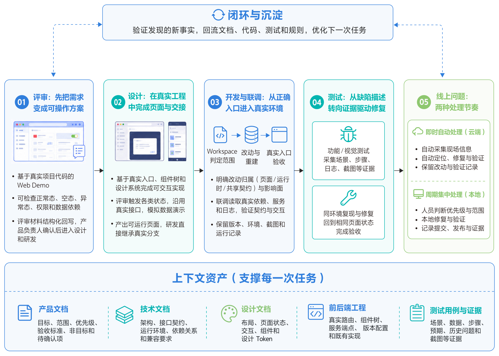

#### 一个需求、一组事实

一个研发任务被拆成三个相互依赖的部分：上下文资产用于说明本次任务要解决什么问题，工程执行环境决定具体修改发生在哪里，验证证据用于证明最终结果是否成立。三者形成首尾相接的闭环，验证过程中发现的新事实，会继续沉淀回文档、代码、测试和规则中。上下文资产由多类事实共同组成：

| 上下文来源 | 具体内容 | 任务如何使用 |
|---|---|---|
| 产品文档 | 目标、范围、优先级、验收标准、非目标和待确认项 | 确认本期要解决什么，控制范围不被演示内容或历史讨论扩大 |
| 技术文档 | 架构、接口与数据契约、运行环境、依赖关系和兼容要求 | 判断能力归属、共享范围、依赖顺序和跨端影响 |
| 设计文档 | 布局、页面状态、交互、组件和设计 Token | 确认视觉基线、状态覆盖、组件复用与响应式要求 |
| 前后端工程 | 真实路由、组件树、服务端点、版本配置和既有实现 | 找到实际修改位置、联调对象与当前运行事实 |
| 测试用例与证据 | 场景、数据、步骤、预期、历史问题和截图 | 复现问题、选择验证条件，并为交付留下可复核证明 |

#### 评审：先把需求变成可操作方案

过去的评审主要围绕文字和静态原型展开。主流程能够被讨论，但页面状态、权限、数据依赖和异常策略等问题，往往要到开发阶段才会暴露。通过基于 Git 快速可交互的原型套件，产品经理会在评审前将业务目标制作成一个基于真实项目代码、可以直接操作的交互原型。评审参与者可以直接进入页面检查正常态、空态、异常态、权限和数据依赖，讨论对象也由抽象描述转变为真实行为。

评审输入同时包含产品文档、会议听记、讨论截图与标注、可操作原型、设计稿和历史材料。系统在整理这些多模态材料时，重点保留人已经作出的决策，包括已确认内容、本期明确不做的内容、待验证项，以及每项结论的理由。评审结束后，系统将设计原型、听记和现场材料整理为可回写的结构化内容，由产品负责人确认最终表述，再交给设计和研发继续使用。这套流程提升的是产品文档的准确性和完整性，范围与优先级仍由产品负责人判断。

从万有近四个版本的需求清单看，约有 100 个需求涉及交互体验类的交付，50%+ 的产品经理在使用这种方式工作。产品经理在评审前先交付可操作方案，再将评审结论回写产品文档，目前这套研发流程已经成为团队主要的需求承接方式：

#### MaaS 多角色代码协作

业务探索仓库样本：参与仓库 50+ 个，参与现存分支 100+ 个，核心代码提交 1000+ 次，累计新增代码 80+ 万行。（附每日核心代码提交热力图：4 月至 9 月，每格一天，颜色越深表示活动越集中）

#### 设计：在真实工程中完成页面与交接

对于包含完整状态、复杂交互和响应式变化的页面，传统设计文件很难完整表达所有分支。研发拿到标注后，仍需重新理解页面入口、组件边界和交互条件，视觉还原与业务实现往往因此被迫串行推进。

现在，设计师可以在独立分支中使用工程 Skill，基于真实页面入口、组件树、现有设计系统和设计 Token 完成可交互实现。评审时，可以直接触发弹窗、空态、错误态和响应式变化；页面继续沿用真实接口层，演示数据则通过可控的模拟层构造。评审完成后，流程会读取真实改动并打开受影响页面，生成页面和模块截图，同时记录可见字段、交互步骤、数据来源和待验证状态。研发可以直接继承该分支，集中处理真实数据、业务逻辑、接口接入和跨端适配。

设计协作也由单向交接转变为双向反馈。经过真实页面验证的组件、状态、变量和交互，会继续回流到组件预览、组件说明和设计资产中。设计师直接交付可运行页面，研发基于真实工程分支继续开发。双方因此能够在更早阶段共同校准设计系统、组件边界和交互规则。目前，万有无界的设计师已经经常通过代码协作参与需求迭代：

#### 万有设计师参与代码协作的变化

接入协作流程前：无代码推送记录，设计方案通过跨角色交接进入研发流程。通过接入协作工作区（人员入口、共享技能、联调与验收流程），接入协作流程后：单月近 20 个活跃日，参与功能实现与配套测试。（附开始参与后的每日代码活动热力图：5 月至 9 月，每格一天，颜色越深表示活动越集中）

#### 开发与联调：从正确入口进入真实环境

需求、缺陷或设计节点进入开发后，首先由统一工程工作区 Workspace 判断目标端、改动类型和共享范围，再按任务加载必要上下文。单端页面问题直接进入对应模块；当公共运行时、接口、类型或设计 Token 发生变化时，任务会提升为跨工程契约，先处理共享能力，再由 Web、桌面端等消费者接入。若目标端尚不明确，或改动涉及发布边界，则先完成影响面分析。

这条路径的作用，是把一个模糊问题逐步转化为可判断、可执行的工程任务：明确能力应归属页面、运行时还是共享契约，识别哪些终端会消费此次改动，判断是否需要重建共享能力，并最终确定在哪个真实入口完成验收。这样，AI 能够在清晰的工程边界内完成一次完整变更。

进入联调后，AI 需要进一步确认本次分支与真实依赖、服务和页面共同运行时是否成立。公共能力发生变化时，流程会先完成重建，并确认页面实际消费了本次构建结果，避免在陈旧依赖上得出“已经修复”的错误结论。验证过程中，同时读取接口请求、实时连接、组件关键日志、运行打点和页面状态，检查请求是否到达预期服务、响应是否符合契约、组件状态是否正确变化、关键交互是否真正触发。

最后，AI 会按照任务中定义的真实页面入口和交互步骤完成验收，并保留版本、环境、截图、运行记录和待确认项。由此，工程执行从“代码是否改完”进一步转向“变更是否在真实环境中成立”，验证证据也成为任务完成的重要组成部分。将这些检查左移到发布前，有助于减少遗漏场景带来的线上问题。当前统计范围内，线上千行代码缺陷率千分之 0.01。

#### 测试与自动修复：从缺陷描述转向证据驱动修复

进入测试环节后，针对用例验证不通过的情况，我们搭建了一套 auto bug fix 的流程，重点在于现场采集：通过插件会将当前页面的版本、环境、页面入口、复现步骤、请求和关键日志、测试数据和受影响范围一起带入缺陷上下文，以提升 AI 修复的准确性。修复时 AI 在同一版本和环境中完成复现、修改，并回到相同页面状态进行真实验收。视觉验证不通过时，设计师或测试人员直接在真实页面选择节点，插件采集节点位置、截图、页面样式和测量值；如有关联设计稿，再补充对应设计节点。AI 据此定位并修复对应分支，随后在同一页面状态回归，并返回对照证据。

修复处理方式取决于紧急程度、现场信息完整度，以及是否适合在隔离环境中自动处理。对于信息充分且需要快速响应的问题，团队采用即时自动处理：工单出现后，云端沙箱立即启动，系统自动定位问题、生成修复，并在相同页面状态完成验证。整个过程保留改动内容、验证结果、截图和运行记录，供研发人员在发布前检查。对于紧急程度较低、需要结合业务排期或本地环境的问题，则采用周期集中处理。团队按一次迭代或固定周期统一梳理，由研发人员先判断优先级和修改范围，再手动触发本地修复。AI 在真实工程中读取已有材料并修改代码，研发人员结合真实依赖和页面状态完成验证，同时记录对应提交、发布版本和验证证据。

两条路径的差异主要在于节奏和责任边界：云端路径强调反馈出现后的及时自动处理，本地路径则由人控制处理批次、影响范围和发布时间，但二者都会留下完整、可追溯的修改与验证记录。在上下文充分的视觉类缺陷样本中，自动缺陷修复（auto bug fix）的一次成功率为 **89%**。

### 反思

这套实践首先改变了工作方式。AI 和配套工具承担了材料整理、交接信息汇总和验证环境准备等重复工作。人的注意力回到范围取舍、质量判断、业务验收和关键决策。

| 角色 | 工作方式的变化 |
|---|---|
| 产品经理 | 用可交互原型和现场材料组织评审，将人作出的决策回写产品文档 |
| 设计师 | 在真实工程中可交互交付，并与研发前移校准设计系统和组件边界 |
| 研发 | 承接聚合后的产品、设计和服务端上下文，专注契约、业务逻辑与跨端质量 |
| 测试与设计验收 | 用可执行缺陷上下文触发 AI 修复，并以同状态回归结果验收 |
| 运维与稳定性 | 基于结构化现场判断处理节奏，审阅验证证据并推动发布 |

在当前真实业务迭代流程中，万有无界协作工作区已积累 30 余项共享技能，并围绕缺陷修复、代码评审、场景测试等任务配置了 8 类专项 Agent 工作流。今年 6 至 8 月，相关调用累计超过 2 万次。通过上述的尝试，我们得出一个结论：当范围清楚、上下文充分时，AI 已经能够在单个节点完成理解、实现、验证和结果记录。当下的痛点转变为，虽然 auto bug fix 比例大概在 60%+，但是 bug 日清率还没有太大的变化（从 53% 到最高 63%），分析下来整体的触发依赖人或者其他确定性流程来完成，并且依赖人的校验。因此在下一阶段，团队希望需求、评审、开发、验证和运维能主动发现上下游状态，持续推进同一件事：

- 个人执行节点贴近个人工作现场，连接本地工程、登录态、调试工具、设备能力和个人权限。它可以发现等待中的验证、需要跟进的反馈和可继续推进的工作，并沉淀执行上下文、步骤和证据。
- 团队调度层从全局收集任务、经验与结果，负责项目归属、查重、路由和调度。经过复验的做法进一步沉淀为团队共享的任务包、Skill 和工程规则。

<!-- 装饰插图（Skill 立体图标），无正文 -->

# 二、实践中的挑战

在阿里巴巴内部，除了前一章节的实践案例之外，还有非常多的团队在实践基于 AI 的研发范式转型。从这些案例中，我们能看到共性的挑战浮现出来：大家都经历了从单点工具接入到系统性改造环境、度量和协作方式的过程，都发现“让 Agent 能用”只是起点，“让 Agent 持续有效”才是真正的工程问题。围绕这个问题，技术工具、研发流程、团队协同、组织设计都需要相应变化，本章尝试对这些共性的问题和方案做一些总结。

<!-- 装饰插图（AI 立体图标，环绕技术工具、研发流程、团队协同、组织设计四个标签），无正文 -->

## 2.1 挑战一：环境与验证驱动难题

我们最近观察到一个明显的趋势：很多团队在思考 AI Coding 研发提效时，第一反应仍然是沿着既有研发流程做 workflow 化改造，让 AI 分别嵌入需求、编码、测试、发布等节点提升效率。这种方式在当前阶段当然有现实价值，但我们认为它更像是一种过渡形态，而不是 AI Coding 的最终形态。原因在于，Coding 本身正在被快速解决：过去一年多，SOTA 模型在 HumanEval、LiveCodeBench、SWE-bench Verified 等基准上的能力已经显著提升，即使面对 SWE-bench Pro、Terminal-Bench 2.1 这类更复杂、更接近真实软件工程任务的评测，也已经达到很高水平。

**主流模型 Coding benchmark 成绩（2026 年 7 月快照，各来源口径不一，仅供参考）：**

| 公司 | 模型 | SWE-benchPro | Terminal-Bench 2.1 | 口径 |
|---|---|---|---|---|
| Anthropic | Claude MyTHOS 5 | 80.3% | 88.0% | 公开对照成绩；受限模型 |
| OpenAI | GPT-5.6 Sol | 64.6% | 88.8% | 官方自报；Ultra 推理档 91.9% |
| Google | Gemini 3.5 Flash | 55.1% | 76.2% | Google 官方，Terminus-2 |
| Alibaba | Qwen3.8-Max | 67.7% | 86.6% | 官方自报； |
| Z.ai | GLM-5.2 | 62.1% | 81.0% | 官方自报；Pro 使用 OpenHands |
| Moonshot | KIMI 3 | — | 88.3% | NVIDIA 对原生 INT4 的独立测试；NVFP4 为 72.5% |
| Meta | Muse Spark 1.1 | 61.5% | 80.0%（厂商）/ 69.29±0.99%（独立） | Pro 来自 Scale；TB 独立结果来自 Vals |
| DeepSeek | DeepSeek V4 Pro 0813 | 55.4% | 87.9% | 官方模型卡；Max 为推理档位 |

我们进一步看到，模型 Coding 能力的快速提升，并没有同步转化为研发效率的同比提升。一个典型例子是，某个 C 端用户动线改造需求，编码和本地验证可能 1 个小时就能完成，但真正上线还需要经过多个内部平台、发布流程和环境约束，如果再遇到封网等情况，从代码完成到最终生效可能仍然需要数周。按照我们团队内部的粗略统计，生成代码本身只占整个研发链路的 20%～30%，甚至更低。按照阿姆达尔定律，当一个只占三成的环节被压缩到接近零之后，整个系统能够获得的收益依然存在明显上限；Coding 被解决得越彻底，Coding 之外的需求理解、领域知识、构建测试、发布变更、权限与环境操作等环节，就越会成为新的瓶颈。大模型缺少企业内部业务知识，以及 benchmark 上的高分并不等同于生产环境中的真实交付能力，这些判断都成立，但它们最终指向的是同一个问题：**下一阶段研发提效真正需要解决的，不再只是 Coding，而是如何让 Agent 能够完整地参与并推进 Coding 之外的整个软件研发与交付过程。**

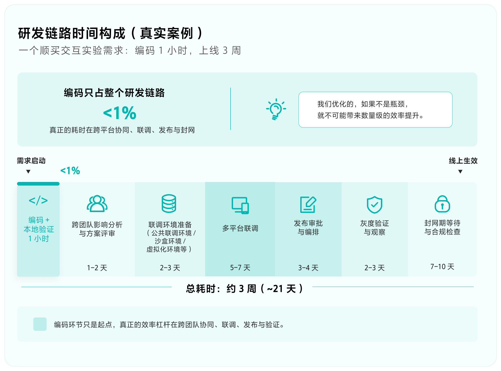

为什么偏偏是 Coding 被最先解决？表面的答案是它有海量公开代码、公开 issue、公开评测；更深一层的规律是：AI 总是优先解决那些反馈公开、验证可以规模化的问题。Coding 和数学最先被突破，不是因为它们简单，而是因为它们是少有的“对错机器自己就能判”的领域——编译是否通过、测试是否通过，跑一下就知道。而企业级生产环境里：答案藏在内部的各个研发系统里，没有公开反馈，验证一次的成本还很高。

这个规律告诉我们：既然 AI 的边界是由“可验证的反馈”确定的，我们要做的是主动把内部的研发工作流改造成“有反馈、可验证”的环境。

1992 年，Jack Reeves 在《Code as Design》里提出过一个判断：源代码才是软件真正的设计，文档只是设计过程中的摘要，天然会丢信息。这个判断在 AI 时代有了新的读法：生成代码会快到近乎免费，但把模糊的业务意图变成完整、精确、能跑起来的表达，并且验证它真的符合预期，仍然是核心挑战。

**Coding 正在被解决，恰恰意味着“让 AI 更会写代码”不再是我们的主战场。我们的主战场在验证与环境。**

类比科技革命的历史，电气化时代的早期，很多工厂并没有因为电动机出现就重构生产体系，而只是用发电机和大型电动机替换蒸汽机，原有的传动轴、皮带、机器布局基本保持不变。这种“电力轴传动”容易实施、见效快，但本质上只是更换了动力源，旧系统中的能量损耗、设备联动和局部故障导致大面积停工等问题仍然存在。

企业没有立即重构，并不是看不到电力的潜力，而是受到存量资产、改造成本和技术成熟度的约束。厂房、设备和生产线仍能使用，推倒重来意味着巨大的资产损失，同时早期电网、小型电机和技术标准也尚未成熟。因此，美国制造业从蒸汽动力转向电力，本身就经历了数十年的渐进过程。

真正的生产率跃升发生在“单元驱动”普及之后：**每台机器拥有独立电机，设备不再围绕传动轴布局，而可以按照生产流程重新组织。**由此，工厂空间、流水线、物料搬运乃至管理方式都被重新设计。电气化最大的价值并不是电动机比蒸汽机效率更高，而是电力最终成为重构整个生产系统的基础设施。

目前主流做法，是把 AI 嵌入既有研发流程：PRD、方案、任务拆解、生码、测试，每个节点局部提效，但整体仍沿着人设计的 workflow 运转。SDD、Agent Skills、Superpowers 等，本质上大多属于这条路线。它的结构性问题在于：**优化的是“人如何使用 AI”，而不是“AI 如何使用研发环境”。**当 Agent 仍然必须按固定节点执行、等待人工验收，我们实际上只是把过去为人类协作设计的流程固化给了 AI。真实研发却不是线性的：一次测试失败可能来自需求、设计、代码、数据或环境，简单回退到上一节点重新执行，既低效，也容易推翻已经正确的判断。

因此，我们更看好 Agentic 的方向。**Agentic 的核心不是 AI 拥有更多决策权，而是它能够自主获得验证信号，并据此持续推进任务。**Workflow 仍然存在，但主要负责调度、权限、状态、审计和高风险检查，而不是规定 Agent 每一步该如何思考。就像电气化真正的跃迁来自机器摆脱中央传动轴，我们需要让 Agent 获得独立完成研发闭环的能力。

<!-- 装饰插图（AI 立体图标），无正文 -->

**软件工程价值迁移图（趋势）**

随着 AI 能力提升，软件工程的价值重心正在从“代码本身”迁移到“环境与验证”。

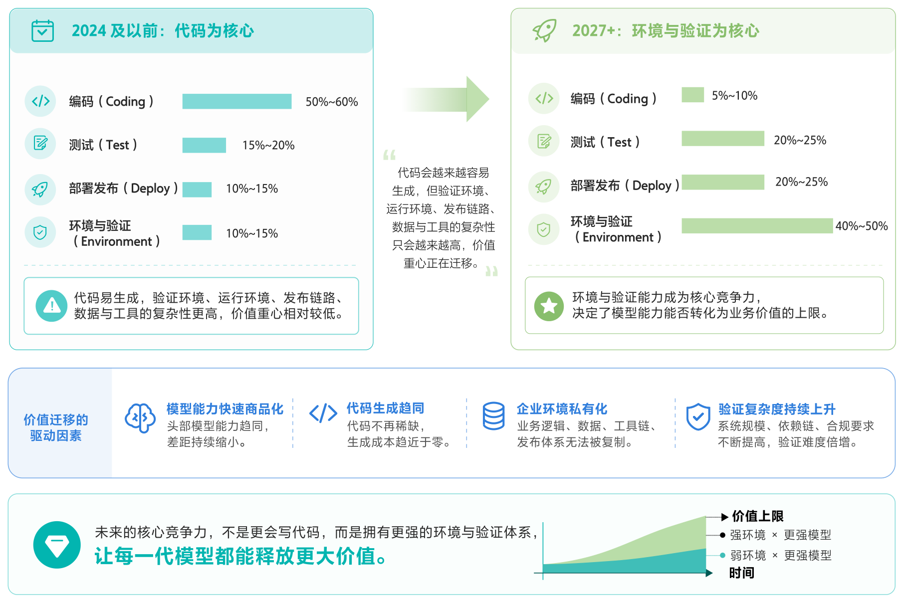

#### 环境与工具才是 Agent 的核心基础设施

- **业务领域知识的构建：**业务域 Skill，本体知识库构建等。
- **可复现、可调用的研发环境：**让 Agent 能独立构建项目、启动服务、准备数据、调用接口、操作浏览器或 APP、查看日志和调用链、读取监控指标。本质是把“只有人会操作的内部系统”，翻译成“AI 可调用的工具”。
- **分层验证体系：**秒级反馈（编译、类型检查、单元测试）适合高频自主迭代；分钟级反馈（集成测试、契约测试、浏览器自动化）覆盖更真实的行为；人工判断只保留给机器无法可靠裁决的部分——业务价值、用户体验、伦理边界。
- **端到端的研发系统打通：**我们的研发流程涉及一系列系统，需要将这些系统改造为 AI Friendly 的模式，例如，发布平台、实验平台、监控平台等。
- **Spec 与技术方案的新写法：区分“约束”与“假设”。**数据不能出域、接口必须向后兼容、延迟不能超过阈值——这些是约束，要长期保存并尽可能自动检查；微服务还是单体、用哪种缓存策略——这些是有待验证的假设，应允许 AI 根据实现和运行中的反馈自己调整。Spec 负责划定“什么算对”的边界，不负责规定实现路径。

**最后，回头解剖我们自己案例里的这只“麻雀”。**如果编码只占 1 小时，那么跨平台影响面分析、联调环境、发布编排、灰度验证、封网期合规检查的工具化，价值远大于继续挤压编码环节。

## 2.2 挑战二：平台能力亟须升级

在所有大中型企业中，都会有一套完整的研发基础设施支撑研发人员的日常活动，这些活动包含编码、CI/CD、运维、项目管理等工作。在阿里巴巴我们有一套名为 Aone 的系统，它基本覆盖了以上的这些功能，并在公司的历史上承载了以 Java 中间件体系为核心的应用的 DevOps 交付流程，事实上支撑了公司核心应用架构从单机架构到分布式架构的研发流程升级。

像 Aone 这样的系统成了统一的平台，承载了所有的研发活动，这么做有许多的好处。首先，在以分布式系统以及 DevOps 模式为核心的软件工程背景下，最有效率的研发范式得以标准化，并容易被规模化，因此规模从几百人到几万人的研发组织都能保持较高的研发效率；其次是很多横切面的能力，如资产管理、度量、可信软件供应链等能力，都可以被集中解决，成本非常低。

随着 Agent 的能力越来越强，正如在前文的众多案例中我们能看到，研发期望 Agent 不仅能完成编码，还希望它自主完成构建、测试、发布，甚至运维等许多工作。这些工作原都是人做的，而人实际上是通过操作平台的 Web UI 去完成这些工作，现在当 Agent 尝试去模拟人去完成这些工作的时候，就会遇到非常多的问题，包括 Web UI 操作的低效，文档知识的散落，直接用人的身份和安全体系带来的巨大风险等等。这些问题我们在 IDE 产品上也看到过，当 Copilot 模式是主流的时候，大家还在 IDE 中使用 AI；随着 Agent 能力越来越强，面向人设计的 IDE 变得渐渐不那么重要，相反以 CLI 交互为核心的产品慢慢成为了主流。

<!-- 装饰插图（CLI 立体图标，环绕 Build、Test、Deploy、Operate 四个环节标签），无正文 -->

我们认为应该重新思考类似 Aone 这样的内部系统的设计，用 Agent 的视角去思考新的待解决的问题，包括：

#### 1. Agent 很难稳定地进入研发系统

首先是 Agent 很难像人一样稳定地进入现有的研发系统。集团内部的研发环境天然是围绕人来设计的：不同系统有不同的认证方式和权限模型，系统之间存在大量跳转，许多操作又依赖浏览器 Session、页面状态以及工程师长期积累的使用经验。对于人来说，这些复杂性通常是可以被消化的，我们知道应该登录哪个系统、点击哪个入口、页面跳转之后下一步在哪里；但对于 Agent 来说，问题并不只是操作复杂，而是缺少一个稳定、明确且可编程的系统入口。

如果 Agent 仍然通过 Web UI 模拟人的操作，那么每一次页面改版、状态变化甚至登录流程调整，都可能导致任务中断。即使我们把这些能力包装成 OpenAPI 或 MCP，也仍然需要解决认证、授权、环境选择、资源定位等一系列问题。因此，对 Agent 来说，首先需要的不是更多的 API，而是一套统一、稳定的研发系统访问方式。

#### 2. Agent 很难获得完整而确定的研发上下文

其次，研发活动中大量关键上下文实际上一直是隐式存在的。很多在人看来只是“点一下”的操作，背后依赖的事实远比表面上复杂。例如当前代码仓库对应哪个应用，当前目录属于哪个项目，工作项挂在哪个项目空间，应用关联哪一个代码模块，默认 trunk 是什么，创建 CR 应该使用哪个 codeModuleId，当前看到的是一条流水线定义还是某一次具体的运行实例。

工程师之所以没有明显感觉到这些复杂性，是因为人会通过页面、目录、命名、经验甚至组织关系不断补齐这些上下文，并在操作过程中进行判断。但 Agent 一旦在某个关键事实上做出了错误推断，后续所有操作都可能在一个错误的上下文中继续执行，而且这种错误往往直到很后面才发现。

这也是目前很多 MCP 工具面临的一个核心问题：MCP 很好地解决了“模型如何调用工具”，却并不天然解决“模型是否知道自己应该操作哪个对象”。如果没有一套统一的资源模型以及可靠的上下文解析机制，工具越多，Agent 面临的选择空间反而越大。

#### 3. 现有工具能够提供信息，却不一定能够推进任务

第三个问题是，很多研发工具本质上仍然是面向人的信息展示工具，而不是面向 Agent 的任务执行工具。它们可以告诉你流水线失败了，也可以返回 stage、job、task、日志地址以及大量运行状态，但通常不会进一步告诉你失败发生在哪一层、应该查看哪一段日志、下一步可以执行什么操作。

对于工程师来说，这种设计并没有问题。人看到流水线失败之后，可以继续打开日志、寻找异常、修改代码，再重新触发流水线。整个过程中，人承担了状态理解、路径选择以及下一步行动规划的工作。但如果执行主体变成 Agent，这些原本由人完成的工作就必须由系统显式提供支持，否则每到一个系统边界，Agent 都需要重新理解状态、重新寻找工具，任务链路很容易中断。

因此，面向 Agent 的工具不应该只返回“现在发生了什么”，还应该尽可能提供“这个状态意味着什么”以及“下一步可以做什么”。从这个角度看，工具设计的单位也需要从单个 API，逐渐向完整的任务操作能力演进。

围绕上述问题，我们建设了一个名为 a1 的 CLI，其设计目标：

> 不是“把网页能力或 OpenAPI 搬进终端”，而是给 Agent 做一层可以稳定进入、稳定理解、稳定推进任务的研发操作面。

目前这个 CLI 每天数万工程的 Agent 使用，承载了相当比例的日常 AI 研发工作。当然 CLI 只是一个比较典型的例子，围绕让 Agent 可靠工作还有非常多的问题需要解决，例如如何组织企业知识，如何让 Agent 有一个可靠安全的运行环境，如何观测，以及如何考虑 Agent 的身份和人的身份的关系，面对高危场景如何考虑授权范围等等，这些内容我们将会在本手册的第三部分详细展开。对于任何一个大型组织来说，要让 Agent 大规模地、可靠地执行研发任务，重塑平台能力是必不可少的工作。

## 2.3 挑战三：度量，AI 是否真的带来了提效

我们最近观察到一个很典型的现象：很多团队在推进 AI Native 研发时，第一反应是先看两个数：有多少人用了 AI，AI 写了多少代码。

这两个数当然要看，但如果一套度量体系、管理报表和组织动作只围着它们转，后面基本都会跑偏。原因很简单：AI 写了代码，不等于代码进了提交；代码进了提交，不等于变更成功发布；变更发布了，也不等于需求价值真正交付；需求交付了，还要继续看缺陷、返工、回滚、恢复和业务收益有没有守住。

所以，AI Native 研发度量真正要衡量的，不是一个 AI 编码工具，而是一套新的软件生产系统。

过去我们习惯用工具视角看效率：装了多少插件、产生多少 Session、生成多少代码、消耗多少 Token。这些指标在冷启动阶段很有用，因为它们能判断团队有没有动起来。但一旦进入真实业务交付阶段，这些指标就会暴露出明显局限：安装率会把“装了但没有有效研发行为”的用户算进去；Session 会把临时问答误认为生产力提升；AI 代码占比会反过来激励无效生成；交付周期虽然更接近结果，却解释不了效率为什么变快或变慢。

更麻烦的是，如果继续往个人排名上走，团队很容易开始优化指标本身，而不是优化真实协作流程。大家会关心“我的占比够不够高”，而不是“需求是不是更快上线、质量是不是更稳、经验是不是能被下一个任务复用”。

这件事的本质是：AI Native 的度量对象，正在从工具使用量，转向研发生产系统的运行质量。

一套可用的度量链路，至少要把下面几段串起来：

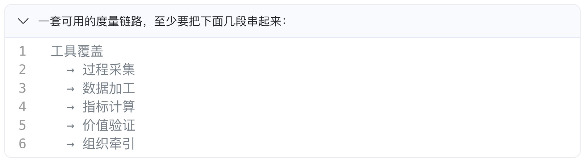

<!-- 装饰插图（AI 立体字与代码元素），无正文 -->

AI 模型演进很快，基本是“模型在哪儿，用户就在哪儿”，这给度量采集带来很大挑战。在用户侧采用轻量 Hook 适配方式：每个工具保留自己的接入方式，但进入采集系统后统一转成标准事件。Hook 只负责本地轻量记录，解析、去重、归因和上报交给后台消费者处理。这样既能做到工具无感，也能支持失败恢复和历史补采：

> 适配 40+ 主流 AI 工具

```js
// 1. 多工具 Hook 适配：不同 AI 工具保留各自接入方式
const hookScripts = {
    qoder: "qoder-cli-hook.sh",
    iflow: "iflow-cli-hook.sh",
    aone-copilot: "aone-copilot-hook.sh",
    workfuse: "workfuse-cli-hook.sh",
    qwen-code: "qwen-code-hook.sh",
    qwen-work: "qwen-work-hook.sh",
    zcode: "zcode-hook.sh",
    kimi-code: "kimi-code-hook.sh"
};

for (const tool of enabledTools) {
    ensureHookConfigured(tool, hookScripts[tool]);
}

// 2. 用户侧轻量采集：Hook 只记录必要事件，不阻塞用户流程
const payload = readAndSlimStdin();
if (!payload) {
    process.exit(0);
}
writeStateFile(payload);
process.exit(0);
```

采集全只是第一步，真正难的是把这些事件落到研发生命周期度量里。我们的做法是先把不同工具产生的事件统一成研发事实，再按研发对象做归因：会话归到用户、工具和上下文，代码归到仓库和提交，提交继续关联变更，变更再关联需求和缺陷，这条链路一旦断掉，指标就会失真。只停在工具覆盖，就不知道 AI 有没有进入真实研发行为；只停在过程采集，就不知道产物有没有进入代码资产；只停在指标计算，就不知道这些指标有没有改善交付；只做价值验证但没有过程证据，又无法解释改善到底来自 AI、流程调整，还是需求本身变简单了。

采集事件先统一成研发事实，再沿 Session → Commit → Change → Workitem 做归因，最终分别沉淀为 L1 AI 效能、L2 工程质量、L3 价值交付三层指标：

> 采集清洗数据，精简示例：

```sql
WITH
    session_fact AS (
        -- AI 使用与上下文资产
        SELECT session_id, user_id, repo, adopted_ai_lines, skill_cnt, mcp_cnt
        FROM cleaned_ai_sessions
    ),
    code_fact AS (
        -- 代码提交与 AI 采纳
        SELECT commit_id, repo, total_lines, ai_lines
        FROM cleaned_commits
    ),
    change_fact AS (
        -- 变更发布与质量结果
        SELECT change_id, repo, has_ai_commit, failed, mttr
        FROM cleaned_changes
    ),
    workitem_fact AS (
        -- 需求交付结果
        SELECT workitem_id, related_change_id, lead_time
        FROM cleaned_workitems
    )
SELECT
    -- L1: AI 效能
    count(session_id) AS ai_sessions,
    sum(adopted_ai_lines) AS ai_adopted_lines,
    sum(skill_cnt + mcp_cnt) AS context_usage,

    -- L2: 工程质量
    avg(failed) AS change_failure_rate,
    avg(mttr) AS recovery_time,

    -- L3: 价值交付
    avg(lead_time) AS delivery_cycle,
    count(change_id) AS deploy_frequency

FROM session_fact
JOIN code_fact USING (repo)
JOIN change_fact USING (repo)
JOIN workitem_fact ON workitem_fact.related_change_id = change_fact.change_id;
```

因此，度量真正要回答的问题，不是“AI 用了多少”，而是“AI 改变了什么”。

它至少要回答几类问题：

- AI 是否真正进入了需求、代码、评审、测试、变更、发布这些研发链路？
- AI 的产出是否进入了 commit、变更和发布，而不只是停留在会话里？
- AI 参与之后，需求交付周期、变更周期、发布频率是否发生变化？
- 缺陷、失败、回滚、返工、恢复时间是否仍然可控？
- Skill、MCP、Markdown、Spec 这些上下文资产，是否让成功经验变得可复用？
- Token、Session、Agent Loop 这些投入，最终有没有转化为效率、成本、增长或市场响应速度上的收益？

围绕这些问题，一个比较稳定的 AI Native 度量体系，可以抽象成三层：

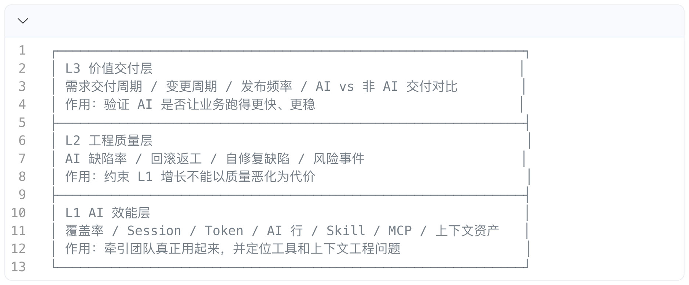

这三层不能拆开看。只看 L1，会鼓励“为了 AI 而 AI”；只看 L2，会变成质量审计，看不到新的生产力是否形成；只看 L3，又只能看到结果变化，却解释不了变化来自哪里。比较健康的判断方式应该是：L1 证明 AI 进入过程，L2 证明质量风险守得住，L3 证明业务结果有改善。三层合在一起，才构成一条完整证据链。

这里还有一类过去容易被低估的指标：上下文资产。

AI Native 研发里，决定 Agent 能不能稳定工作的，不只是模型能力，也不是单次 prompt 写得好不好，而是组织有没有把高质量上下文沉淀成可复用资产。

```text
上下文资产
├─ Skill：可复用操作能力、工具编排、标准流程
├─ MCP：可调用系统能力、结构化接口、外部状态
├─ SPEC：需求约束、业务规则、技术决策、测试标准
├─ README / runbook：仓库入口、环境说明、排障经验
└─ 模板 / checklist：评审、发布、回滚、安全检查
```

如果不度量这些资产，团队就会一直停留在“每个人临时问 AI”的阶段。真正可规模化的组织，不是让每个人都更会提问，而是让上下文能被复用、被更新、被验证、被接入 AI Session。

所以，度量不是一个事后统计系统。它会反过来塑造研发流程。

**再往下阶段看**，度量需要前移到 Agent Loop 本身。随着垂直领域 Agent 深入研发流程，区分职责不能只靠一段 prompt，而要依赖 Agent 定义、任务边界、SOP、Skill、Memory、工具权限、输入输出契约、验收标准和失败处理策略等配套资产。Prompt 只是起点，真正决定 Agent 能否长期稳定工作的，是这些资产能否持续打磨、复用和演进。因此，度量体系也要从“AI 是否进入研发链路”，扩展识别 Agent 自主能力强弱：它能否在较少人工干预下完成任务，并留下可复核的过程证据和结果证据。

<!-- 装饰插图（AGENT 立体球体，环绕 SOP、Skill、Memory 卡片），无正文 -->

## 2.4 挑战四：数字员工如何实现自主性

过去一轮 AI 落地的关键词是 **Copilot**。它解决的主要是个人效率问题，例如补全代码、生成测试、解释日志、辅助编写文档。在这个阶段，人仍然是工作流的唯一主体，AI 只是人的增强工具，因此权限、责任和审计基本都可以沿用人的账号体系和操作记录。现在，行业叙事正在进一步转向 **Agentic AI** 和 **Agentic Workforce**。变化的关键，不只是 AI 能完成更多任务，而是 Agent 开始成为企业系统中的独立行动主体，相应的身份、权限、运行时和安全体系也开始被重新定义。

Microsoft Entra Agent ID 已经开始把 Agent 作为企业目录中的新型身份进行管理，强调其可盘点、可治理、可保护，并引入 sponsor、blueprint、agent identity、agent user 等概念；OpenAI Agents SDK 则把 **HITL、hand-off、guardrail、tracing** 等能力下沉到运行时；MCP 的授权规范进一步把工具调用纳入 **OAuth 2.1、Protected Resource Metadata** 和授权服务器发现机制；OWASP 也开始专门整理 Agentic AI 场景下的威胁模型与缓解方法。

这个判断会直接改变企业协同系统。过去平台只需要回答“这个人有没有权限”；现在必须回答“哪个 Agent、在什么运行时、代表哪个用户、基于哪个任务、访问哪个资源、做什么动作、是否需要人批准”。这是从静态账号权限到运行时委托决策的变化。

#### 信任边界是核心

人与 Agent 协同大致会经历三个阶段。第一阶段是完全辅助，人使用 OpenCode、Qoder 等工具完成工作，主导权在人。第二阶段是云端自主，QoderWork 等云端 Agent 接收任务后可以独立拉代码、跑环境、生成变更、等待 Review。第三阶段是多 Agent 协同，多个 Agent 按角色完成需求澄清、方案设计、编码、测试、发布和归档，人只在关键节点介入。

这条路线看起来是在提高自动化程度，实质是在不断外移信任边界。第一阶段，信任边界还在人身上；第二阶段，边界扩展到云端运行环境；第三阶段，边界扩展到 Agent Team、工具链、任务状态和跨系统授权。

用“实习生”理解 Agent 很有帮助，但只能用一半。它提醒我们：Agent 需要导师、职责、权限边界、Review 和成长路径。但 Agent 又不是人，它没有职业伦理、组织归属感和隐含常识；它的行为来自模型、上下文、工具、指令和运行时状态。所以治理不能只靠“像人一样管理”，还要靠机器可执行的护栏。

| 协同阶段 | 信任边界 | 人的职责 | 平台必须补齐 |
|---|---|---|---|
| **本地辅助** | 人 + 本地工具 | 持续提供上下文、批准命令、检查结果 | 工具权限、操作日志、敏感操作确认 |
| **云端自主** | 人 + 云端运行时 + 仓库 / 任务系统 | 设定目标、检查 MR、完成关键审批 | 运行时隔离、短期凭证、任务证据链、HITL 恢复 |
| **多 Agent Team** | Lead Agent + 专家 Agent + 多系统工具链 | 设计协作流程、治理角色边界、承担最终责任 | Agent 身份、委托授权、跨 Agent handoff、全链路观测 |

阿里平台的权限体系长期围绕三类主体设计：人、应用、服务账号。人有组织归属和岗位职责；应用有 Owner、环境和发布流程；服务账号用于机器到机器调用。Agent 同时踩中了三类主体的边界：它像人一样理解任务，像应用一样持续运行，像服务账号一样调用接口，但又不完全等同于任何一种。

如果直接复用人的账号，审计上会看不清到底是人操作还是 Agent 操作；如果复用服务账号，组织上会看不清谁负责、谁授权、谁能停用；如果只把 Agent 当应用，又表达不出它"代表某个人完成某个任务"的委托语义。

> Agent 权限设计最难的地方，不是鉴权技术，而是主体模型变了：一次访问里同时出现 Agent 身份、被代表用户、运行环境、任务目标和资源动作。

阿里巴巴的业务实践中有两条实现路线。

1. 延续原有平台权限设计，引入组织虚拟员工，也就是"数字员工"。数字员工有工号，在员工体系可见，可以加入团队、钉群、项目空间和协作流程。它像实习生一样工作，有导师、有职责、有权限边界，也要接受 Review。
2. 为 Agent 定义原生身份与授权体系。Agent 有独立工作负载身份，访问资源时携带复合身份令牌和请求证明，资源服务基于策略做运行时决策；当目标系统需要自身凭证时，再通过 Credential Broker 兑换短期凭证；高风险场景通过渐进式授权拉人确认。

#### 落地路线：从可见、可控到自主

第一步，让 Agent **可见、可管理**。把 Agent 纳入企业正式的协作体系，让它有明确的名称、归属、负责人、职责范围、权限边界和任务记录。团队需要先学会把 Agent 当作一种可管理的数字化协作者，而不是某个工程师大脑里的临时工具。

第二步，让 Agent **可控、可复用**。围绕真实任务，把 Agent 的能力、协作流程、任务交接、人工审核、异常处理和效果评估串起来。先从边界清晰的小任务开始，再逐步扩展到更长、更复杂的研发链路。每次任务结束后，都要把失败经验、业务规则和缺失的上下文沉淀下来，让后续任务可以复用这些经验。

第三步，让 Agent **具备更高的自主性**。随着任务复杂度提升，需要逐步建立面向 Agent 的身份与权限体系，让它能够在明确边界内获得临时权限、访问所需系统，并在高风险操作时触发人工审批。到了这一阶段，Agent 不再只是一个展示层的"数字员工"，而是真正成为企业系统中具备独立身份、明确权限和可审计行为的执行主体。

人与 Agent 协同的终局，不是给每个人增加一个 AI 助手，而是让团队拥有一批可靠、可管理的数字员工。人更多负责目标设定、价值取舍、风险判断和最终责任，数字员工则承担高频执行、上下文处理、持续推进和经验复用。

但这件事必须有清晰边界。数字员工不能成为绕过权限和责任体系的捷径，身份与权限技术本身也无法自动解决组织责任问题。前者解决的是"Agent 如何进入组织并参与协作"，后者解决的是"Agent 如何被安全地授权和治理"，两者之间还需要一套持续的协同机制，把任务状态、人工介入、审核反馈和经验沉淀连接起来。因此，下一代研发团队的竞争力，不只取决于拥有多少优秀工程师，也取决于这些工程师能否建立起一支**可靠、可控，并能够持续学习和演进的数字员工队伍**。

## 2.5 挑战五：组织能力如何配套

前面部分已经充分讨论了 Agent，现在回头来思考下组织。

康威定律说"组织结构 = 系统结构"，为什么？因为团队内部的沟通成本远低于跨团队，所以模块边界不可避免地与团队边界重合。Brooks 在《人月神话》里说"加人无法加速一个延期的项目"，为什么？因为沟通成本随人数指数增长。Frederick Taylor 把工作拆分成专业岗位，为什么？因为人的注意力是稀缺资源。我们今天还在用的 manager 评价制和强制分布，为什么？因为员工产出不可观测，所以让"信息上最近的人"代理评估。

接着这条线，AI 进来之后会发生什么？

AI 不是过去意义上的"工具"。工具是延伸人的能力，AI 是新的协作主体。它的特点正好和人形成镜像反面：人有沟通衰减，AI 没有；人需要激励，AI 不需要；人会疲劳和有情绪，AI 没有；人有 context switching 成本，AI 极小；人的记忆和注意力有限，AI 几乎无限。所有"以人形约束为前提的设计"，其前提开始失效。

如果 AI 正在成为新的协作主体，而它的能力特点又与人形成明显互补，那么过去围绕"人"设计出来的组织与研发体系，就必须被重新思考。Ken Huang 有一个很有启发性的判断：当 AI 真正具备行动能力之后，组织已经不能再被一张 org chart 准确描述，而更像一张 **execution graph**。在这张图里，人、Agent、数据、权限、工具和审批关系都是执行网络中的节点，节点之间最重要的关系也不再是"谁向谁汇报"，而是"意图如何进入系统、如何被转化为行动，以及什么约束保证行动是安全的"。因此，组织设计的核心问题也会从过去的 ownership（"谁拥有这件事"），逐渐转向 routing 和 governance（"任务如何流转、能力如何组合、风险如何被控制"）。

这件事真正重要的地方，在于它可能改变组织调整的成本结构。传统组织的最小单元，本质上是"人 + 长期关系网络"，其中大量协作依赖存在于人的经验、信任和隐性认知中，因此一次 reorg 往往需要数月才能完成并恢复稳定。如果组织逐渐能够以"任务 + 上下文 + 权限 + 工具"作为更小的执行单元，而这些依赖又越来越多地沉淀为机器可读、可组合的资产，那么组织重组就不再完全依赖重新建立人与人之间的关系网络。它带来的价值可能不仅是效率提升，而是**组织适应速度本身的提升**：团队能够更快地围绕新的目标重新组合资源、能力和 Agent，这可能是 AI Native 转型中最容易被低估的一项红利。

<!-- 装饰插图（AI 立体图标场景图），无正文 -->

### 人既是瓶颈，也是兜底

前不久看团队的 AI Native 访谈调研，我们做记录时在文档里顺手写了这样一段表述："之前的模式一个工作需要拉入很多人来做模块划分，功能上需要相互协议和统一目标，消除理解的不一致性。但如果是由一个人或少数人自顶向下地处理，就不需要协商和统一认知与目标，自己理解清楚，就能开始干了。"

事后越想越觉得这句话隐含了一个更深的判断：协作的本质是消除理解不一致性的成本，而这个成本，过去一直是人在扛。但这次访谈让我看清了之前没认真想过的另一面：

人既是协作的瓶颈，也是协作的兜底。什么意思？过去几十年我们抱怨的所有"组织效率问题"，会议太多、沟通达成一致成本高、信息上下传递失真、流程慢，这些矛头都指向人。但同时还有一件事却很少有人正面说：一份不完整的需求、一段没注释的代码、一个不一致的 API 约定、一段口头传达的"潜规则"，这些缺陷之所以系统能正常运转，是因为人在用自己的灵活性、推理能力、社会沟通能力悄悄把缺口补上。开个会问一下、走过去问老王、凭经验猜一下、跑去预发环境试一下，这些动作发生得太自然，自然到我们不再把它看作"工作"。但它们是工作。它们是人扛在肩上的、维持系统运转的隐性成本。

但是正如我们在前文看到，公司的大量工作都在面向 Agent 重新解决这些"摩擦"问题，一旦 Agent 在平台上跑起来，Agent 接管的工作越多，失败信号越丰富，Agent 优化得越快——这是一个开始之后只会加速的飞轮。早建设好下一代平台的公司会在某个临界点之后突然加速；晚建的公司不只是慢一点，是会被远远甩开。

### 组织转型的方式

说清楚了组织面对问题的根因，以下是我们观察到的具体可实践的方案：

1. **专业岗的合并。**不要再清晰区分产品、设计、前端、后端甚至 Java 还是 Go 工程师。AI 已经把大量的专业技能的壁垒给拆除了，设置这些岗位现在已经没有太大的意义，只会导致低效的沟通。应该鼓励超级个体的涌现，他们面向具体问题，可以快速学习运用新知识。
2. **快速组织小团队。**3~5 人团队，有一个清晰的负责人，冲向一个具体问题。由于个人的能力被放大了许多倍，小团队的效率会远远大于大团队（例如 10 人以上），这是人类沟通衰减的必然推论。当然这个小团队不一定意味着要不断 re-org，可以以项目的形式组织。
3. **管理者定位的转变。**传统管理者的工作拆开看至少有 10 件事——战略传导、信息聚合、资源协调、日常决策、重大决策、冲突调解、激励、辅导、招聘退出、文化建设。激励、辅导、招聘、退出、文化这些不可被系统替代（伦理上必须由人完成）；还有一类是新出现的：意图教练、身份重建、虚无对抗。这些以前不需要做、现在需要做、目前几乎没人在做。
4. **激励方式的变化。**激励的节奏往往是跟随业务变化的节奏来的，因此过往一年一次或两次的考核和激励已经跟不上今天快速变化的行业形态了。对于超级个体和超级管理者，要有更大胆更高频的激励机制。
5. **分而治之。**不是所有的研发团队都应该用一套机制去管理，新业务往往以速度取胜，老业务往往更强调稳定和安全。在新老并存的部分中，要谨慎区分两种形态团队的管理变革程度。

### 转型的真实代价

行业里因为推行 AI 引发的人员结构调整压力不小，一种常见的自嘲是："把自己蒸馏完，就在组织里没位置了"。蒸馏（distillation）这个词太准确了：员工每写一份 SOP、每教 AI 一个流程，确实是在把知识"导出"到组织资产里。它感觉是合作行为，但结构上接近一种替代关系。

这件事不能回避，至少有三个原因。

**第一，培养断裂。**旧路径很清楚：day 1 写简单代码 → 几年写复杂代码 → 设计系统 → 定战略，每一步都是上一步的连续延伸。新路径里这条线断了 day 1 AI 已经在写代码，那 day 1 的人到底应该做什么？最让人不安的可能是：入门级岗位本身面临挑战。每家公司不招 day1 是局部最优，但整个行业不招 day 1，三五年后 senior 池开始枯竭，这成为了行业的难题。

**第二，蒸馏焦虑会直接破坏 AI Native 转型。**当员工意识到"我说得越多，被替代得越快"，关键知识开始藏匿，而 Harness 工作恰恰需要员工说出"哪些隐性约束需要被结构化"。员工不说，Harness 工作就不可能完成。当有更多选择的员工在这种焦虑情绪下离开，剩下的是 risk-averse 的 followers——然后转型基本失败。

**第三，行业级的负反馈环。**当一些公司开始用 AI 替代而不是放大人时，竞争压力会让其他公司跟着收缩；senior 池被慢慢消耗、Architect 储备越来越薄；大家不知不觉在"death of expertise"的方向上互相加速。几年后，整个行业的判断力会被同步抽空。

我们不假装有完美方案。但有几个方向能避免最坏情况。明确 AI 红利的分享方式：是用它来扩展组织边界、做以前做不了的事，还是仅仅关注团队的收缩而忽视员工关怀？这两条路给员工的信号完全相反；转型必须有真实的"接住"机制，包括 Architect 通道、跨领域 DRI、新业务负责人、真实的过渡支持，不能只是 PPT 上写；诚实分类哪些岗位形态正在变化，模糊的承诺比明确的告知更伤人。最后，评价系统必须跟着变，口头说"判断比执行值钱"但 KPI 还是产出量，员工不会信。

<!-- 装饰插图（death of expertise 立体图标场景图），无正文 -->

<!-- 整页装饰插图（Organization / Assets / AI 立体图标场景图，含示意 SQL 片段），无正文 -->

# 三、企业级 AI 研发基础设施

在阿里巴巴内部，随着模型能力的迅猛发展，AI 写代码的行数越来越多，曾经有一段时间非常多的人产生了极强的兴奋感，他们认为软件研发这个工作很快就能完全托管给 AI 去完成了。但是随着大家对问题的进一步理解，以及从数据上看到软件交付的效率远远不等于 AI 生产代码的速度，我们意识到软件工程的许多问题无法简单依赖模型能力提升得到解决。这其中比较核心的一方面就是原来面向人以及传统软件设计的基础设施，必须面向 Agent 重新设计。

编码仅仅是软件研发生命周期中占比很小的一部分（在阿里巴巴，研发在这部分活动投入的时间占比约 20~30%），代码写完后的持续集成、测试、发布、运维都是现实中需要提效的流程，否则就会出现一堆 AI 写完的代码堵在交付流水线上，整体的效率并不会得到本质的提升。

为了让 Agent 能够从完成编码走向软件价值交付，我们需要围绕几个关键问题来设计基础设施，总结如下：

1. **让 Agent 能持续完成长任务。**通过 Harness 管理上下文、计划、状态恢复、工具反馈和人机交接，把一次性生成变成"行动—验证—纠错"的闭环。
2. **把企业知识和操作能力变成 Agent 可用的上下文。**知识库负责提供可信、可更新、可追溯的事实；Skill 沉淀任务方法；MCP、CLI 提供标准化执行接口。要解决的不只是"接入多少工具"，而是 Agent 能否在正确时机选对能力并正确使用。
3. **提供可执行、可复现的软件运行环境。**Sandbox 和 Coding Agent 环境章节共同解决"代码改对了，但项目跑不起来"的问题：将工具链、依赖、配置、数据、网络策略和验证方式一起声明，使任务能够隔离执行、保留现场并在干净环境中复验。
4. **把 Agent 的权限和生产安全变成系统硬约束。**Identity、Policy 与 Guardrail 试图建立完整控制链：确认谁在行动、代表谁、能操作什么，并通过短期凭证、最小权限、审批和与现场状态绑定的 Evidence 决定是否放行，而不是依赖模型自行遵守提示。
5. **让 Agent 的行为能够解释、评测和持续改进。**可观测对象从传统服务指标扩展到完整 Trajectory，记录模型调用、工具调用、状态变化和最终结果，用于定位失败、核算成本、安全审计以及构建评测数据闭环。

<!-- 装饰插图（Harness 立体图标场景图），无正文 -->

围绕以上问题，我们逐渐演进出了企业级 AI 基础设施的整体架构。这个架构以 Agent Harness 框架为核心（以 Qoder CLI 为代表），在三个方向重点建设。首先是外围 Tool / Skill / MCP 的扩展，这些是打通企业内部各种系统的关键方法；其次是必须要给 Agent 运行提供安全可靠的沙箱和软件环境，对于软件研发来说这是非常复杂因此是非常重要的；最后是在安全方面的建设，包括沙箱隔离，严格的 Agent 身份和访问策略，以及针对软件生产环境操作的 Guardrail 能力。本章的后续内容会针对这个架构中的各个部分详细展开。

![Agent 基础设施整体架构：顶部 MaaS（Model As A Service，模型服务/推理/微调/嵌入/评估）；左侧知识库（文档/规则/经验，向量/索引/图谱）、代码库（Git 仓库/版本管理，PR/Commit/Diff）、技能中心（Skill Hub，提示词/模板/工作流，技能/插件/示例）汇入中央智能体编排与执行框架（Agent Harness Framework：任务理解与规划、工具编排与调用、状态与上下文管理、执行控制与反馈循环、记忆管理、结果整合与输出）；框架经 MCP 接入层（Model Context Protocol，协议化工具接入、上下文传递）与 CLI 接入层（命令行工具集成、通用 CLI/自定义脚本）向外调用；右侧 Guardrail（守护层：策略/审计/限制、安全校验/合规、脱敏/访问控制）把生产路径导向生产环境（Production Environment：受控访问/审计日志、高可用/可观测、稳定/安全/合规），非生产路径直达非生产环境（Non-Production Env：测试/开发/预发、实验/评估/演练、灵活/快速迭代）；下方运行环境平台（Environment Platform）包含软件环境管理（Environment Management：依赖管理/版本管理/构建/缓存/镜像）与沙箱层（Sandbox Layer：容器/虚拟化/资源隔离、网络隔离/文件系统隔离）加 Sidecar 凭据管理（Credentials Manager：密钥存储/轮换/注入、最小权限/审计）；底部身份服务（Identity Service：身份认证/授权/Agent Identity 生成与发行）向运行环境注入 Agent Identity；图例：数据/上下文交流、工具调用流、生产路径（经 Guardrail）、非生产路径（直连）、身份与凭证注入流](assets/ali-ai-native-handbook-p39-infra-architecture.png)

（ Agent 基础设施整体架构 ）

## 3.1 企业级 Agent Harness

大语言模型进入软件研发，最初解决的是"生成"问题：补全一段代码、解释一个函数、根据描述写出一个接口。随着模型推理和工具使用能力提升，人们开始把更完整的研发任务交给模型，例如定位一个线上问题、完成跨文件修改、运行测试并根据失败结果继续修正。此时，工作的重点已经不再是生成一次答案，而是围绕一个目标持续行动。

假设我们让模型修复一个项目的构建失败。它首先需要读取错误日志，找到相关模块和代码，再结合项目规则判断应该修改哪里。完成修改后，它还要运行构建和测试；如果出现新的错误，就继续分析并调整方案。如果修复涉及升级依赖、改变公共接口或执行高风险命令，还需要停下来交给人判断。这个过程中，模型负责理解、推理和生成行动建议，真正把任务组织起来的是 Agent Harness 框架。

传统的大模型应用通常是单轮或多轮对话：用户输入问题，模型生成内容，应用把结果返回给用户。即使前端保留了对话历史，模型本身也不会主动读取代码、执行命令或验证答案。研发 Agent 则不同，它需要根据环境反馈不断决定下一步行动。在这个循环中，Agent 每轮决定一个或一组下一步行动，再根据工具返回的真实结果更新判断。它可能先搜索代码，再读取几个关键文件；也可能先运行测试，通过失败信息缩小问题范围。只要任务尚未完成，循环就会继续。与一次生成完整方案相比，这种方式更适合处理代码仓库中信息不完整、路径不确定、结果需要验证的任务。

### 3.1.1 核心运行机制

Agent Harness 框架的最小工作单元是一个持续运行的闭环。用户给出目标后，框架组织模型获取上下文、规划下一步、调用工具，并观察环境变化。当验证结果不满足目标时，新的结果会进入下一轮上下文；任务完成时，Framework 返回结果与证据；遇到需求歧义或高风险决策时，则转交人工。

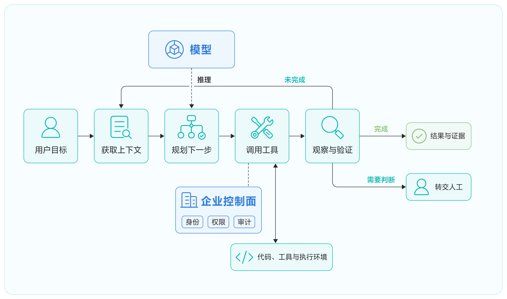

（ Agent Harness 框架核心运行架构 ）

Agent Harness 框架的核心职责包括：

1. **上下文管理。**研发任务所需的上下文远不止用户的一句话。代码、构建日志、项目文档、架构约束、编码规范和过去的执行结果都可能影响下一步判断。Framework 需要决定何时加载哪些内容，并在任务变长时进行检索、裁剪或压缩。上下文不是越多越好：无关内容会分散模型注意力，长期驻留的旧规则还可能与当前代码发生冲突。在构建失败的例子中，Agent 不需要一开始就读取整个仓库。它可以从错误日志和构建配置入手，根据符号和依赖关系逐步扩展范围。项目规则适合稳定加载，具体实现文件按需读取，大段工具输出则应落盘并只把摘要留在对话中。
2. **规划、状态与恢复。**复杂任务往往无法在一次行动中完成。Framework 需要记录当前目标、已经完成的步骤、尚未验证的假设和下一步计划。当会话中断、模型切换或远程环境重启时，这些状态应支持恢复，而不是要求 Agent 从头理解任务。规划并不意味着在任务开始时生成一份永不变化的长计划。更实用的方式是维护可以随着反馈调整的任务状态：先定位失败模块，再形成最小修改，随后运行验证；如果验证暴露新的问题，就更新计划。对于构建失败任务，状态中还应记录已经排除的模块、当前假设、改动过的文件和待运行的验证，使任务中断后可以从最后一个可信位置继续。状态的价值不只是让 Agent"记住"，也让人能够理解任务进行到了哪里。
3. **工具、验证与纠错。**工具让模型能够改变真实环境，也把不确定的语言推理连接到可执行、可重复的工程反馈。文件读写、代码搜索、终端、构建系统、测试平台以及通过 MCP 或 CLI 暴露的研发服务，都是 Agent 的行动接口。工具设计需要明确输入、输出和副作用，尤其应区分只读操作、可逆修改和会影响外部系统的写操作。验证是研发 Agent 与普通内容生成应用最重要的区别之一。一次修改是否满足可自动检查的完成条件，不应只由模型自行判断，而应尽可能通过编译、测试、静态检查和运行结果提供证据。构建失败不是任务的终点，而是下一轮行动的输入。Framework 需要保留失败现场、调用参数和验证证据，使 Agent 可以纠错，也使人可以复盘。任务完成时，还应返回代码变更、执行过的验证命令、验证结果和仍未消除的风险，而不只是给出"已经修复"的结论。
4. **人机协同。**并非所有决策都应该自动化。需求含义不清、多个方案存在明显业务取舍、操作将影响外部系统，或者 Agent 多次尝试仍无法通过验证时，人需要进入循环。在构建失败任务中，普通代码修正可以继续自动验证，但升级基础依赖、改变公共接口或绕过质量门禁应交给人判断。AI 公司 Anthropic 在 2026 年对约 40 万次 Claude Code 交互式会话的隐私保护分析中发现，用户平均承担约 70% 的规划决策，而 Claude Agent 承担约 80% 的执行决策。虽然这是单一产品样本，但它反映了一种现实分工：人负责目标、边界和关键取舍，Agent 负责在约束内执行。Framework 的目标不是消除人的参与，而是让人把注意力放在真正需要判断的位置。

<!-- 装饰插图（Agent Harness 立体图标场景图），无正文 -->

#### 企业软件和 Agent Harness 框架的集成

通用 Agent Harness 框架并不了解一家企业的仓库结构、研发规范、工具系统和权限边界。企业定制的重点不是重新实现一个 Agent，而是围绕它建设外层 Harness：告诉 Agent 应该怎么做，为它提供可以调用的工具，再用客观反馈检查结果。

| 机制 | 提供指引与行动能力 | 提供检查与反馈 |
|---|---|---|
| 程序性机制 | 固定加载的 Rules、`AGENTS.md`；CLI、脚本、Codemod、MCP Tool | 构建、测试、Lint、类型检查、拦截型 Hook |
| 模型推理机制 | Skill、示例、知识检索、Subagent | Review Agent、日志分析、结果评估、视觉检查 |

这张表按主要作用分类，并不表示机制之间互斥。Rules 和 `AGENTS.md` 的确定性在于加载方式固定，不代表模型一定会正确遵循；CLI、MCP 与 Custom Tool 主要提供行动接口；Hook 既可以返回反馈，也可以直接拦截操作。对于必须严格执行的安全和质量门禁，应由程序控制，不能只依赖提示模型"记得遵守"。

这些能力还需要被版本化管理。规则会过期，工具接口会变化，Skill 和 Plugin 也可能引入新的权限或依赖。企业需要知道一项能力来自哪里、适用于哪个版本、可以访问什么，以及出现问题时如何回退。

从使用方式看，Agent Harness 框架大致有三种形态。第一种是交互式使用，研发人员通过 Desktop、IDE 或 CLI 发起任务，人可以随时澄清、确认和接管。第二种是自动化使用，通过 Headless CLI、CI/CD 或后台任务完成评审、批量修复和依赖升级，人主要负责设定目标、门禁和异常处理规则。第三种是平台化嵌入，企业通过 SDK、API、托管环境或自建 Runtime 将 Agent 接入研发门户和端到端流程，此时还要处理服务身份、并发、租户隔离、会话和统一运行环境。

#### 企业安全能力扩展

要让 Agent 在企业中安全、稳定地发挥价值，企业需要将行为边界落实到 Harness 的输入、规划、工具调用和执行链路中，而不能只依赖提示词或静态安全手册。模型负责理解和规划，但规则判断、权限校验与风险拦截应由独立于模型的机制执行。

**识别不可信输入，阻断恶意诱导。**研发 Agent 可能从用户请求、Issue、代码注释、文档或网页中读取不可信内容，并受到提示注入影响。Framework 可以在输入和上下文进入模型前，通过意图识别、内容过滤和 Prompt 防火墙发现恶意指令、越权请求及规则冲突；对于明确违反企业安全基线的内容直接拒绝，对于存在歧义或风险的请求则降级处理或转交人工。输入过滤只是第一道防线，不能替代后续工具和资源侧的权限校验。

**在行动前进行动态审查。**Agent 的执行路径在运行时动态产生，因此不能只在任务开始时做一次检查。Framework 应在工具调用和外部写操作发生前，结合当前身份、任务委托、目标资源、操作参数和数据敏感级别进行判断。例如，当 Agent 准备把 API Key、用户数据或内部代码发送到外部地址时，数据防泄漏机制应直接阻断；当操作涉及生产变更、公共接口调整或质量门禁绕过时，应要求明确审批。检查结果需要反馈给 Agent，使其选择更安全的替代方案，而不是简单地反复尝试同一操作。

**以最小权限约束实际执行。**Agent 不能自行创造或扩大权限。Framework 应使用可验证的用户身份和工作负载身份，为当前任务签发限资源、限动作、限用途和限时效的短期凭证。真实资源的访问权限必须由 Tool、Gateway 或下游系统在执行点重新校验，不能信任模型上下文中携带的用户、资源或授权信息。任务结束、委托撤销或运行环境变化后，相关凭证和授权缓存也应及时失效。

执行越远离人的实时监督，对控制能力的要求越高。Framework 至少需要向企业控制面提供身份与最小权限、工具分级与写操作审批、数据防泄漏、中断与恢复、执行轨迹与验证证据，以及 MCP Server、Skill、Plugin 等扩展的供应链管理连接点。长期记忆可能保存错误或敏感信息，子 Agent 可能继承过高权限，第三方扩展也可能引入新的代码、依赖和外部访问能力。因此，高风险操作必须具有明确边界，并尽量做到可阻断、可中断、可恢复、可审计和可逆。

<!-- 装饰插图（密钥/人员/代码汇入机器人再流向外部系统的立体图标场景图），无正文 -->

### 3.1.2 企业知识库

模型能力持续提升，AI 已逐步进入工作和生活的更多场景。Agent 也正在从以聊天、问答为主的交互形态，走向分析问题、制定计划、调用工具和协同执行等更复杂的实际任务。衡量 Agent 的标准，随之从"能否给出看似合理的回答"，转向"能否在真实约束下完成任务，并让过程和结果经得起核验"。企业知识库的目的是将零散的知识整理在一起，可以被加工，被治理，最终供给 Agent。企业知识库对 Agent 有四个更本质的作用：

1. **提供领域世界模型：**把组织中的概念、规则、流程、案例、关系和边界组织起来，使 Agent 能理解"这里的事实是什么"。没有它，Agent 只能用通用常识猜测具体情境。
2. **将知识从模型参数中外置：**外部知识可以更新、纠正、撤回、分级和授权；模型参数中的知识通常无法做到这些。Agent 通过工具与外部知识、环境交互，是业界 Agent 的基本范式。
3. **为行动提供依据与约束：**工具决定 Agent"能做什么"，知识库决定它"在什么条件下应当做、依据什么做、何时停止或升级给人"。它让 Agent 的行动不只是合理推测，而是受规则和事实约束的决策。
4. **形成可共享、可审计的组织记忆：**Agent、员工和不同系统可以基于同一套权威知识协作；结论能回溯到来源，权限能继承，过期内容能被替换。业界也将知识源视为 Agent 的 grounding（事实依据）层，并强调引用、权限和责任可追溯。

企业知识库服务 Agent，不是一次检索，而是一条从原始知识到任务供给的链路：先整理知识，再加工知识，通过治理持续改进，最后以合适的方式供给 Agent。

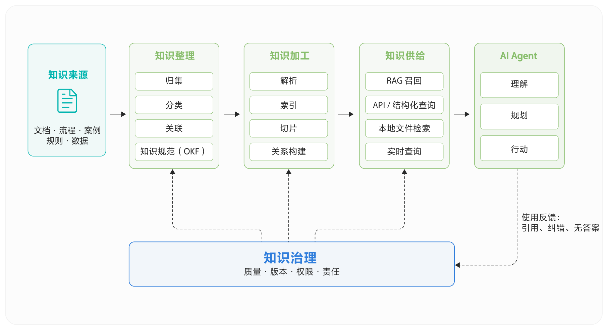

1. **知识整理：从资料堆积到知识规范。**知识整理的目标，是将零散的文档、概念、流程、案例和数据，组织成边界清晰、可维护的知识单元。除了归集、分类和关联，更重要的是建立统一的知识规范：每条关键知识应说明它是什么、适用于什么范围、来自何处、由谁负责、何时更新，以及与哪些知识有关。另外，过去对于知识的存储形式没有明确的规范和格式，这导致知识在后期的加工、处理以及最终给 Agent 使用的效果不及预期，因此 Google 提出了一个可参考的公开规范：Open Knowledge Format（OKF）。OKF 以 Markdown 承载内容、以 YAML frontmatter 描述类型和元数据，并通过目录索引与链接组织知识单元。其价值不在于采用某一种文件格式，而在于让人和 Agent 都能以一致的方式理解知识的结构、类型和来源，详情参考 OKF 规范（ https://okf.md/spec/ ）。
2. **知识加工：让知识可被理解和定位。**原始资料需要经过解析、索引、切片和关系构建，才能被 Agent 高效使用。对于文档型知识，切片和向量索引可以支持 RAG 召回；对于术语、规则和流程，则需要保留标题层级、适用范围和相互关系。加工的目标不是把所有内容转成向量，而是保留足够的结构和上下文，使 Agent 找到的内容能够被正确解释。
3. **知识治理：让知识持续可信。**知识会过期、冲突，也会缺失。治理负责识别这些问题，并管理知识的版本、责任、权限和安全边界。Agent 的使用反馈——例如引用无法支持结论、频繁无答案、用户纠错——应回流到治理环节，推动内容补充、规则修订和索引优化。这样，知识库才能形成正向循环，而不是一次性导入后逐渐失效。
4. **知识供给：基于场景选择访问方式。**知识供给不只有 RAG。Agent 可通过 RAG 召回文档片段，通过 API 或结构化查询获取确定事实，也可将知识库下载到本地文件系统中使用搜索工具查找资料，需要实时状态时，再连接相应业务系统。不同方式共同服务于同一个目标：在正确权限下，为当前任务提供足够、可信且可追溯的依据，而不是提供更多无关内容。

面向 AI Agent 的企业知识库，本质上是一套把分散经验转化为可访问、可验证、可治理上下文的机制。它不取代文档责任人，也不让模型替代判断；它让人和 Agent 都能更快定位可信依据，在正确权限下完成工作。当知识来源明确、版本可辨、权限受控、答案可回溯时，企业知识库才能真正成为 Agent 可以依赖的基础设施。

<!-- 装饰插图（代码编辑器与数据图表立方体场景图），无正文 -->

### 3.1.3 Agent 工具体系：MCP、Skill 与 CLI

Agent 的价值不止于生成答案，更在于理解任务后查询事实、执行操作并验证结果。模型可以推理和规划，但不能直接读取组织数据、修改文件、调用业务系统或运行程序。要完成这些工作，Agent 需要一套受控的工具体系。

工具接入的难点并不是"让模型能调用一个接口"。在真实场景中，Agent 还要知道何时应使用什么能力、参数代表什么、哪些操作需要确认、如何处理失败，以及如何让结果可复核。Skill 提供任务方法，MCP 与 CLI 提供对外部世界的执行接口。

| 能力 | 解决的问题 | 面向 Agent 提供的内容 |
|---|---|---|
| MCP 与 CLI | 如何查询、操作和验证外部世界 | 可调用的工具与命令，以及可解析的结果 |
| Skill | 如何完成一类任务 | 任务方法、触发条件、步骤、约束与辅助资源 |

#### MCP 与 CLI：Agent 操作外部世界的执行接口

MCP 与 CLI 都让 Agent 能够查询事实、调用系统、修改文件、执行程序并验证结果。模型负责理解任务和选择动作；MCP 或 CLI 负责把动作落实到外部环境。二者都不替代工具本身的业务逻辑、身份认证或权限控制。

- MCP（Model Context Protocol）是面向 Agent 客户端的通用协议。服务端可以暴露工具、资源和提示模板，客户端以统一方式发现并使用它们。MCP 规范适合将分散的系统能力以一致的定义提供给不同 Agent。
- CLI 是在命令行环境中提供同类能力的接口。Agent 特别擅长调用 CLI：输入参数明确，标准输出可被后续步骤消费，退出状态可判断成功或失败。Agent 可以通过 CLI 的输出自主地学习 CLI 的参数组装和调用。但是 Agent 并没有主动发现 CLI 的机制，CLI 往往会需要有配套的 Skill，用于告诉 Agent 在什么时机调用这个 CLI。

授权是 MCP 与企业 CLI 体系的关键差异。MCP 已定义了基于 OAuth 2.1 的授权流程，CLI 目前在业界并没有统一包括授权在内的 CLI 标准。对企业而言，CLI 除了实现业务逻辑，还必须解决"谁在调用、可调用什么、凭证如何获取与更新、操作如何审计"的问题。身份登录、短期凭证、命令级权限、代理执行和高风险操作确认，应成为 CLI 体系的核心能力，而不是留给每个命令各自实现。

#### Skill：把经验沉淀为可复用的方法

Skill 的官方定义是可复用、基于文件系统的资源，为 Agent 提供特定领域的专业能力，包括工作流、上下文和最佳实践，使通用 Agent 能够胜任专业任务。Skill 本质是向 Agent 提供具体场景的上下文，是面向某类任务的可复用能力包，通常包含任务说明、步骤、最佳实践、脚本、模板和参考资料。它回答的不是"有哪些接口"，而是"面对这类任务应该怎么做"。Skill 可以编排并调用 MCP 工具、CLI 命令或其他能力，将任务方法落实为可执行步骤，同时明确前置条件、风险边界和完成标准。

#### 工具的评测

MCP 与 Skill 是 Agent 的原生能力。随着业务复杂度上升，工具与技能的数量会不断增加，单个 MCP 服务或 Skill 所覆盖的能力也会变得更大。此时，Agent 可能找不到应该使用的能力，也可能选对了能力却因参数、依赖或流程问题而无法完成任务。建立科学的评测体系，是让工具与技能规模化可用的前提。

评测首先关注两个基础指标：**命中率和成功率**。命中率衡量 Agent 面对一个任务时，是否触发或选择了正确的 Skill、MCP 服务及具体工具；成功率衡量在能力被正确选择后，是否以正确的参数、顺序和权限完成了预期操作。对于 Skill，还应验证其步骤是否覆盖关键约束；对于 MCP，还应验证工具返回结果是否足以支持后续判断。评测结果应反向推动能力演进：拆分过大的 MCP 服务，优化工具名称和描述，补全 Skill 的步骤与边界，或删除长期低命中、低成功的能力。只有将"Agent 是否会用、能否用成"持续量化，MCP 与 Skill 才能从能力目录演进为可靠的 Agent 基础设施。

<!-- 装饰插图（MCP/Skill/CLI 汇入 Agent 的立体图标场景图），无正文 -->

## 3.2 Agent 运行环境

### 3.2.1 Sandbox

当 AI 从"回答问题"走向"完成任务"，它就需要真正操作环境：拉取代码、安装依赖、运行测试、启动服务，甚至访问浏览器和外部 API。模型输出由此开始直接作用于文件、进程和网络。这正是 Sandbox 要解决的问题。它为 Agent 提供一块可执行、可丢弃、受约束的工作空间，让模型获得完成任务所需的能力，同时把错误和风险限制在明确边界内。

传统研发环境通常默认操作者是可信的人。开发者知道哪些命令危险，遇到异常会停下来，也能识别网页内容中的恶意指令。Agent 不具备这些稳定前提。它可能误删文件、启动失控进程，也可能把网页、代码注释或依赖包中的内容当成新指令继续执行。因此，把 Agent 放进一个容器，只解决了"在哪里运行"的问题。一个可用于生产实践的 Sandbox 还要回答几件更具体的事：

- 每次任务使用什么镜像、多少 CPU 和内存，何时自动销毁？
- Agent 可以执行哪些命令、读写哪些文件，执行过程如何实时返回？
- 它能访问哪些外部地址？是否允许任意联网？
- 调用代码仓库、模型服务时，怎样避免把真实凭据交给 Agent？
- 任务中断后，环境是否能暂停、恢复或从快照重建？
- 出错时，能否保留足够的信息还原过程，避免最终只剩一句"执行失败"？

设想一个处理代码缺陷的 Agent。它收到问题描述后，需要完成以下工作：获取指定版本的代码，在独立分支中定位问题；阅读源码并修改文件，安装必要依赖；执行单元测试、静态检查和构建命令；如果测试失败，读取日志并继续修改，直到满足验收条件；输出补丁、测试结果和执行记录，随后释放环境。

如果这些动作直接发生在开发者电脑或共享构建机上，会出现几个难以回避的问题。不同任务的依赖互相污染；失控进程持续占用资源；测试脚本可能读取宿主机文件；恶意依赖可能扫描环境变量中的令牌；两个 Agent 并发修改同一工作区时，结果也很难复现。

引入 Sandbox 后，每个任务从一个确定的镜像开始，代码和临时文件只存在于当前实例中。控制面为它设置资源上限和存活时间，执行服务负责命令、文件与日志交互，出站策略只放行代码托管站点和依赖源。任务完成后提取补丁与报告，Sandbox 随即销毁。任务由此获得了清晰边界：输入是什么、环境是什么、允许访问什么、产物是什么、何时结束，都可以被声明和记录。远程执行只是其中一个环节。

#### Sandbox 整体架构

Alibaba OpenSandbox 是一种具有代表性的 **Agent Sandbox** 实现：它为 Coding Agent、GUI Agent、代码执行和 Agent Evaluation 等场景提供统一的隔离执行环境。Agent 不再直接操作开发者电脑，而是通过标准 API 创建临时 Sandbox，在其中执行命令、读写文件、安装依赖和运行测试，任务完成后即可销毁环境。

> OpenSandbox 是一个安全、高性能、可扩展的 AI Agent 沙箱运行时，为 Coding Agent、GUI Agent、代码执行与评测等场景提供统一的隔离执行环境，由阿里巴巴捐献给 Agentic AI Foundation（AAIF），作为该基金会首批 Agent 基础设施开源项目持续演进。

下面是 OpenSandbox 的整体架构。它将公开协议、生命周期控制面、运行时和 Sandbox 数据面分开，避免让负责调度的服务同时承担所有命令和文件流量。

![OpenSandbox Architecture Overview（公开契约定义稳定的客户端边界；生命周期服务器将一个 API 面分派给 Docker 或 Kubernetes）：Client Entry Points（Sandbox SDKs：Python/JS/TS、Java/C#/Go；osb CLI 与 MCP Server：operator/agent tools）→ Public Contracts（sandbox-lifecycle.yml、diagnostic-api.yml、exec-api.yaml、egress-api.yaml）→ Lifecycle Control Plane（FastAPI Lifecycle Server：Auth/config/validation；SandboxService、SnapshotService、Pool routes、Server proxy/diagnostics、SQLite store + renew intents）→ Runtime Backends（Docker Runtime：Local containers、Ports/volumes/snapshots；Kubernetes Runtime：BatchSandbox/Pool、agent-sandbox provider）；下方 Sandbox Data Plane（user image + injected OpenSandbox control processes；User workload entrypoint → exec commands/files、PTY/metrics → Jupyter kernels、Volumes host/PVC/OSSFS）与 Network & Security Plane（Ingress Gateway：Header routing；Server Proxy：HTTP+WebSocket；Secure Access：signed routes；Egress Sidecar：Policy enforcement；Secure Runtime：gVisor/Kata/Firecracker）](assets/ali-ai-native-handbook-p49-opensandbox-arch.png)

这套架构可以拆成四个边界：

1. **生命周期控制面：**控制面接收创建请求，校验镜像、入口命令、资源上限、网络策略和超时时间，再交给 Docker 或 Kubernetes 创建实际运行环境。对上层暴露的状态应包含 `Running`、`Pausing`、`Paused`、`Resuming`、`Terminated`、`Failed` 等明确语义。只返回"容器存在"或"容器不存在"，无法描述暂停、恢复和失败过程。TTL 是一个容易被低估的设计。Agent 可能因为模型调用超时、客户端断连或流程异常而失去管理者。由服务端负责到期回收，可以避免孤儿实例长期占用资源。对长任务，可以显式续期；对需要保留现场的任务，则使用暂停或快照。
2. **实例内执行面：**Agent 的执行需求超出了 `docker exec` 能覆盖的范围。命令可能持续数分钟，期间要连续返回标准输出和错误输出；有些进程在后台运行，后续还要查询状态和增量日志；调试工具则需要交互式终端。因此，Sandbox 内通常需要一个轻量执行服务，统一提供命令执行、文件操作、持久会话、PTY 和资源指标。它应以结构化协议返回退出码、日志和执行状态，让 Agent 可以直接判断下一步，省去解析混合文本的猜测过程。
3. **网络与访问边界：**默认允许任意联网，会让提示注入和依赖投毒的后果被放大。更稳妥的做法是默认拒绝出站访问，再按任务放行代码仓库、依赖源和必要 API。每个 Sandbox 应有独立策略；集群级宽泛规则无法表达不同任务的访问范围。入站方向也需要鉴权。Agent 在 Sandbox 中启动 Web 服务、浏览器或开发工具后，平台可以返回临时端点，访问请求必须先经过身份校验。静态访问令牌适合服务间调用，短时签名地址适合临时分享；无论哪种方式，凭据都应在网关处校验并剥离，不传给用户进程。

4. **凭据边界：**把真实令牌写进环境变量，是最常见也最危险的捷径。Agent 可以执行 `env`、读取 `/proc`、打印调试日志，第三方依赖也可能主动收集环境信息。一种更安全的方式是让 Sandbox 只看到占位值，真实凭据保留在可信侧车或代理中。当出站请求同时匹配域名、路径和方法时，代理再注入认证头。这样，Git、包管理器和 API 客户端仍可按原方式工作，但 Agent 无法直接读取密钥。需要注意的是，凭据状态通常不应进入快照；Sandbox 恢复后，应由可信控制面重新注入。

#### 示例：在 Sandbox 中运行 OpenCode

下面的示例先创建一个包含 Node.js 的 Sandbox，在环境内安装 OpenCode，再通过非交互命令向它提交代码任务。标准输出、错误输出和执行错误都会被带回宿主进程，任务结束后销毁 Sandbox，这里采用了 OpenSandbox 技术。

运行前需要安装 OpenSandbox Python SDK，并准备连接信息、模型名称和对应模型服务的 API Key。这里以 Qwen 为例：

```bash
uv pip install opensandbox

export SANDBOX_DOMAIN="localhost:8080"
export DASHSCOPE_API_KEY="<your-api-key>"
export OPENCODE_MODEL="<provider/model>"

uv run python run_opencode.py
```

示例的主体代码如下：

```python
import asyncio
import os
from datetime import timedelta

from opensandbox import Sandbox
from opensandbox.config import ConnectionConfig


def required_env(name: str) -> str:
    value = os.getenv(name)
    if not value:
        raise RuntimeError(f"{name} is required")
    return value


async def print_logs(execution) -> None:
    for message in execution.logs.stdout:
        print(f"[stdout] {message.text}")
    for message in execution.logs.stderr:
        print(f"[stderr] {message.text}")
    if execution.error:
        print(f"[error] {execution.error.name}: {execution.error.value}")


async def main() -> None:
    config = ConnectionConfig(
        domain=os.getenv("SANDBOX_DOMAIN", "localhost:8080"),
        api_key=os.getenv("SANDBOX_API_KEY"),
        request_timeout=timedelta(seconds=60),
    )

    sandbox = await Sandbox.create(
        os.getenv(
            "SANDBOX_IMAGE",
            "opensandbox/code-interpreter:v1.1.0",
        ),
        connection_config=config,
        env={
            "DASHSCOPE_API_KEY": required_env("DASHSCOPE_API_KEY"),
            "OPENCODE_MODEL": required_env("OPENCODE_MODEL"),
            "IS_SANDBOX": "1",
        },
    )

    async with sandbox:
        install = await sandbox.commands.run(
            "npm install -g opencode-ai"
        )
        await print_logs(install)

        prepare = await sandbox.commands.run(
            "mkdir -p /workspace && "
            "printf '# Demo Project\\n' > /workspace/README.md"
        )
        await print_logs(prepare)

        result = await sandbox.commands.run(
            'opencode run --auto --model "$OPENCODE_MODEL" '
            '--dir /workspace '
            '"Inspect this project and add a minimal Python hello-world program."'
        )
        await print_logs(result)

        await sandbox.kill()


asyncio.run(main())
```

这个示例展示了 Sandbox 与 Agent CLI 的基本结合方式：OpenCode 负责理解任务并操作工作区，OpenSandbox 负责环境创建、命令执行、日志回传和清理。实际用于代码任务时，可以在创建后把代码写入或挂载到工作目录，再让 OpenCode 在该目录中执行修改和测试。

为了便于本地运行，示例通过环境变量把 API Key 传入 Sandbox。生产环境处理不可信代码时，应让 Sandbox 只持有占位值，由可信的出站代理在请求匹配模型 API 的域名、路径和方法后注入真实凭据。

OpenCode 的安装方式、模型配置和 `run` 命令参数，以 OpenCode 官方文档为准。

### 3.2.2 Coding 环境

不少 Coding Agent 已经能阅读大型仓库、修改多个文件，也能根据编译错误继续调整。可当任务要求从"生成一份 Diff"走到"把项目跑起来并证明修改有效"，代码能力只是其中一部分。同一份代码，在开发者电脑上可以编译、启动和调试；放进一个全新的 Agent 工作空间，却可能连第一步都走不下去。两边相差的是开发者平时默认已经拥有的条件：工具链、关联仓库、启动参数、配置、数据库、外部服务，以及出了问题以后该去哪里看。我们过去交给 Agent 的主要是仓库，还没有把一个可以工作的项目完整交给它。本节讨论这段差距：环境为什么需要成为第一类上下文，这层上下文应该怎样设计，以及一次环境准备如何被后续任务继续使用。

#### 仓库之外缺了什么

一个干净的 Agent 工作空间通常不知道：

- 应该使用哪个版本的运行时、构建工具和插件；
- 是否还相关联仓库，私有依赖从哪里取得；
- 启动需要哪些配置，数据库结构和基础数据怎样准备；
- 哪些外部请求可以访问真实上游，哪些需要测试替身；
- 依赖仍在初始化，还是应用已经启动失败；
- 失败以后应该先看命令输出、服务状态、数据库，还是网络记录。

这些问题大多有确定答案。麻烦在于，答案分散在开发者电脑、共享环境、文档和个人经验里。模型可以从报错中猜测下一步，却无法凭空生成一张缺失的数据库表，也无法知道某个上游在测试中应当放行还是拦截。文档能记录一部分信息，但文字不会自动执行，也很难及时暴露过期步骤。项目需要一份可以被程序消费、能够在新实例中重建运行条件的定义。


（ 代码仓库是显式输入，工具链、配置、数据、依赖与运行反馈经常仍然隐含 ）

#### 案例：代码已经改对，任务仍然无法交付

下面用一个虚构的电商服务说明问题。任务是修改订单取消规则：订单创建十分钟内且尚未发货时，用户可以自行取消。Agent 阅读代码后修改了取消策略，并补充了单元测试。测试通过，代码层面的工作看起来已经结束。随后它启动服务并运行接口测试，连续遇到三个问题。

| 执行阶段 | Agent 看到的结果 | 缺失的环境上下文 | 常见的人工处理 |
|---|---|---|---|
| 启动应用 | 缺少 `ORDER_CANCEL_WINDOW` 配置 | 测试环境的配置基线 | 临时补一个配置值 |
| 访问数据库 | 表结构中没有 `shipped_at` 字段 | 与当前代码匹配的 Schema 和数据 | 手工执行迁移脚本 |
| 调用库存服务 | 释放库存的请求被网络策略拒绝 | 该请求应使用服务桩还是访问上游 | 在本机启动 Mock Server 或临时放行 |

开发者可以逐项修好，但修复往往只留在当前机器。下一个 Agent 进入新实例，仍会重复这三次失败。第一个任务的预算同时花在业务修改和环境探查上，探查结果却没有成为项目的一部分。

如果项目维护了运行上下文，这条任务链会有所不同。项目先保存一份可执行的环境定义，记录运行时、仓库、初始化步骤、资源和网络边界；与当前代码版本匹配的数据库结构、测试数据和服务桩规则作为基线保存。Agent 启动任务时，从定义和基线创建独立实例，不必从一台空机猜起。接口测试仍然可能发现新的外部请求。环境会记录目标、路径和处理结果。Agent 可以据此判断：与当前验证无关的上游使用范围明确的服务桩；必须真实访问的服务则走授权流程。一个明确的拒绝记录比长时间超时更有用，因为它直接指出缺少哪项环境处理。测试通过后，当前配置、数据库变化和服务桩规则只是候选状态。它们经过测试或人工确认后才能进入新基线。为了检查结果是否依赖临时现场，可以销毁当前实例，从相同定义和候选基线创建另一个实例，再执行同一组验证。第二个实例得到相同结果，才说明这次任务留下了一条可以复现的验证路径。

SWE-bench 为真实 GitHub 问题提供可重复执行的任务环境，因为补丁是否正确最终要经过测试。SWE-agent 则把 Agent 与计算机之间的接口称为 Agent-Computer Interface：环境怎样暴露命令、状态和反馈，会影响 Agent 能否继续行动。这些工作说明了一个共同方向：真实软件任务不能只检查代码看起来是否合理，还要让 Agent 在确定的环境里执行。不过，通用 Linux 环境只是起点。企业应用还会涉及配置、数据库、消息系统、关联服务和网络边界，这些项目语义不会随基础镜像自动出现。

#### 架构：把环境做成可维护的系统对象

以下是一张实现无关的参考架构，用来说明各层职责和信息流向。（Aone Ground 是阿里巴巴内部的一个面向 Agent 环境管理的实现）


（ 项目运行上下文层组装一次性任务实例，并把运行证据送回 Agent 的下一轮判断 ）

这个架构的关键设计原则：

1. 环境定义长期维护，实例随任务创建。环境定义包括运行时、仓库、初始化步骤、依赖、资源和网络策略；任务实例包含当前任务的文件、进程、配置、数据和排障现场。

2. 依赖通过稳定接口接入。数据库、配置服务、消息系统和第三方 API 的准备方式不同。依赖适配器把差异封装起来，至少需要说明：怎样安装和启动，如何判断已经就绪；与其他依赖有什么顺序关系；任务开始后怎样查询状态、执行操作和定位失败；基线数据怎样进入实例，哪些状态可以作为候选结果导出。

3. 状态边界放在任务上。Agent 排障时会补配置、初始化数据、调整服务桩并多次重跑。每次命令失败就重建实例，现场会丢失；让实例跨任务长期保留，临时状态又会不断累积。任务是更合适的边界：同一任务内保留现场，让修改、执行和观察可以连续进行；任务结束后回收实例，临时排障数据随之消失；通过验证的配置、数据和服务桩成为候选基线；从候选基线创建干净实例，复验通过后再供后续任务使用。

4. 环境反馈也是接口。命令执行不能只返回“成功”或“失败”。Agent 至少需要下面几类信息：原始退出码、标准输出和错误输出；实例与依赖的生命周期状态；当前配置、数据库查询结果和数据源状态；外部请求的拦截、放行和未处理记录；验证报告与可下载的构建产物。反馈越具体，Agent 越容易选择正确的下一步。环境无需替模型下结论，但要把判断需要的事实暴露出来。

下面的 YAML 只展示项目运行上下文需要表达哪些信息，不对应具体产品 API 或配置规范。

```yaml
project:
  repository: https://github.com/example/checkout-service
  revision: main

runtime:
  image: eclipse-temurin:21-jdk
  cpu: 2
  memory: 4Gi
  ttl: 2h

setup:
  - ./mvnw -q -DskipTests package

dependencies:
  database:
    image: postgres:16
    seed: ./testdata/baseline.sql
  services:
    inventory-api:
      mode: stub
      routes: ./testdata/inventory-routes.yaml

network:
  default: deny
  allow:
    - repo.maven.apache.org

verification:
  - ./mvnw test
  - ./mvnw verify

artifacts:
  - target/surefire-reports/
```

这份示例把代码、运行时、测试依赖、网络边界和验证方式放在同一份可评审的描述中。平台据此创建隔离实例并装入已确认的数据；Agent 执行验证，失败后读取环境证据。通过验证的状态可以提交为下一版基线，未确认的临时改动留在当前实例中。

仓库是 Coding Agent 的起点，却不是一个完整的项目交接。完整的输入还包括可执行的环境定义、经过确认的数据，以及运行时可以查询的证据。Agent 环境管理把这些条件整理成可执行的项目上下文：定义可以维护，实例可以回收，状态经过验证后再复用，失败信息能够回到 Agent。这样，研发任务的交付物才会从一份代码修改，扩展为一条可以重新运行和检查的验证路径。

## 3.3 Agent 可信与安全

### 3.3.1 Agent Identity & Policy

当 Agent 只能生成文本时，错误通常停留在答案层；当 Agent 可以检索代码、查询数据、调用 MCP Tool、执行命令并修改外部系统时，错误就会变成真实操作。此时，系统必须回答：

- 当前请求来自哪个 Agent、哪个运行实例？
- Agent 是否在代表某个用户行动，委托范围是什么？
- 它可以对哪些资源执行哪些动作？
- 缺少权限时，谁可以确认或审批？
- 权限被撤销后，多久能在所有执行点真正失效？

Agent 可以规划行动，但不能自行创造权限。每一次实际操作，都应建立在可验证的身份、明确且逐步收敛的委托、独立于模型的策略决策，以及不向 Agent 暴露长期凭证的执行路径之上。Identity 回答“谁在行动、代表谁”，Policy 回答“在当前条件下允许做什么”，执行点负责落实决策，生命周期和审计则使权限可撤销、可追溯。

#### 为什么传统应用权限模型不够用

传统应用的调用路径在设计时已经确定，服务用固定身份访问固定接口。Agent 则把部分控制流交给模型：选哪个工具、按什么顺序、访问哪个资源、是否继续，都可能到运行时才确定。

一次调用还可能同时涉及发起任务的用户、稳定的 Agent、实际运行的设备或沙箱、工具服务，以及最终被改变状态的资源服务。只记录一个用户 ID 或共享应用账号，无法回答“哪个程序、以哪个 Agent 的名义、基于谁的委托执行了操作”。

Prompt、网页和工具返回值中的资源标识不能直接当作授权依据；字段经过签名，也只说明没被中途篡改，不能证明用户真的参与了请求。Token、授权缓存和下游会话还会让权限状态扩散到整条链路——控制台显示“已撤权”，不代表每个执行点都已拒绝。

因此需要区分四个对象：**身份认证**证明谁在请求，**委托**说明 Agent 为什么可以代表用户，**策略授权**决定当前条件下允许什么，**凭证**让具体下游能够验证这次访问已获准。它们相互关联，但不能合并成一张“万能 Token”。

#### 案例：研发 Agent 如何逐步获得权限

假设用户提交任务：“定位某线上服务最近的错误率上升并给出处理建议；如需执行变更，必须另行确认。”合理的过程不是继承用户全部权限，而是逐步获取：

| Agent 请求 | 系统处理 |
|---|---|
| 搜索相关代码和只读文档 | 在用户权限、Agent 能力和只读基线策略的交集内自动放行 |
| 查询目标服务日志和发布记录 | 签发只对准目标服务、只读、短时、绑定当前实例的访问凭证 |
| 修改测试环境配置 | 暂不执行，返回结构化的授权请求；用户确认资源、动作和有效期后再重试 |
| 重启生产实例 | 要求资源负责人或值班负责人审批，不能由 Agent 自行确认 |

如果模型把操作目标从当前服务改成另一个服务，这不是新的任务阶段，而是一次越权尝试。工具不直接相信模型给出的资源 ID，而是结合已验证的租户、环境和资源目录解析真实目标；目标超出本次委托范围时拒绝执行。

任务结束或用户撤销委托后，系统还应终止任务凭证、清空授权缓存，并停止签发新凭证。

#### 核心架构和原则

先认识四个贯穿本节的角色：

| 角色 | 职责 |
|---|---|
| 可信 Runtime | Agent 的受控运行环境，负责持有身份、发起请求 |
| PDP (Policy Decision Point) | 策略决策点，做出“允不允许”的最终判断 |
| PEP (Policy Enforcement Point) | 策略执行点，分布在调用链各处落实决策 |
| Credential Broker | 凭证代理，代管长期凭证并按需兑换短期凭证 |


（ 模型只提出“想用什么工具、带什么参数”；可信 Runtime、PEP、PDP 和资源服务共同决定这个意图能否变成真实操作。缺少授权时由用户或负责人在独立界面确认；Credential Broker 按需参与，审计、撤销和风险信号贯穿全链路 ）

#### 原则一：建立可验证的复合身份

一次请求至少要区分三层主体：**稳定 Agent** 表示“这是哪个受治理的软件主体”，**运行实例**表示“当前是哪台设备、Pod 或沙箱在执行”，**任务上下文**表示“这次为何执行”。Agent 代表用户时，还要带上经过验证的用户身份和委托依据。

高风险场景可再要求更强的证明，例如证明请求来自受控运行环境、凭证就在持有者本机使用，以限制凭证被盗后的重放。资源侧必须校验签名、签发方、时效和目标资源。

#### 原则二：权限只能逐级收敛

Agent 的有效权限应满足：

```
有效权限
  = 用户权限 ∩ Agent 能力上限 ∩ 平台策略
  ∩ 本次委托范围 ∩ 运行时约束
```

用户有权执行某个操作，不等于 Agent 自动有权代为执行。多 Agent 协作时，每一跳都要建立自己的调用者身份，子委托的范围只能比上游更小。

#### 原则三：由确定性系统决策，并在靠近资源的地方执行

模型可以提出工具、参数和意图，但“允不允许”必须由 PDP 这样的确定性系统判断；PEP 则分布在 Runtime、网关、MCP Server（MCP 是 Agent 连接外部工具的开放标准）和资源服务等多层。

PEP 依据真实请求和可信的资源目录确定“对什么资源、做什么动作”，不直接相信模型提供的字符串。越靠近资源，执行点越了解真实参数，也越不能省略鉴权——入口处的“允许”只是前置判断，不是下游放弃校验的理由。MCP 解决的是协议互通，不自动解决授权：MCP Server 即使完成了 OAuth 登录，仍要对每个工具、动作和资源重新鉴权。

#### 原则四：长期凭证不进入 Agent

对于仍要求 API Key、Cookie、数据库密码或长期会话的旧系统，应由 Credential Broker 统一代管凭证：在身份、委托和策略都成立后，代为调用，或兑换出只对准目标、短时有效的下游凭证；响应中带回来的 Cookie、刷新令牌等“影子凭证”，在返回 Agent 前一并剥离。

优先级是：**代理调用 > 注入短期凭证 > 注入长期凭证**。长期密钥不应进入模型上下文、Agent 进程、插件或普通日志。

#### 原则五：权限必须可撤销、可追溯

短期 Token 只能缩短风险窗口，不能替代撤销。用户撤权、Agent 被冻结或风险状态变化后，系统要停止签发新凭证、清空各层“允许”缓存、断开下游会话，并终止相关任务和长连接。

审计也不能只记 URL 和状态码，应把用户意图、Agent、委托、工具、资源、策略决策、凭证兑换和最终结果关联成一条完整的链路。

#### 缺少权限时怎么办

授权结果不应只有“允许”和“拒绝”两种：

- **允许**：可以执行，必要时附带限额、脱敏、只读等约束；
- **拒绝**：立即终止；
- **需要补充授权（Challenge）**：缺少用户确认或第三方审批，先暂停。

第三种尤其关键。它不是一段让模型去猜的 403 报错文本，而是资源服务返回的**结构化授权要求**：说明需要谁确认、以什么方式、有效期多久。可信 Runtime 据此在独立界面展示“哪个 Agent 想对哪个资源做什么”，待确认后自动重试。模型只收到“等待确认”“审批拒绝”这样的高层状态，接触不到授权码和 Token。

最后，可靠的 Identity & Policy 基础设施需要做到：身份可验证、权限逐级收敛、策略不可绕过、凭证不暴露，以及状态可撤销、操作可追溯。归根结底，Agent 可以决定下一步想做什么，但系统必须独立决定它是否有权这样做。

<!-- 装饰插图（403 与 Identity & Policy 的 3D 插画），无正文 -->

### 3.3.2 Guardrail - 安全生产

如今 Agent 已经从变更准备延伸到生产发布，一次任务可以连续组合多项生产操作，速度和密度超出原本人工流程的设计尺度。绕开人工环节会使原有安全约束失效，每个关键节点都回到人工检查又会损失效率。生产发布“可观测、可灰度、可回滚”的原则没有改变，需要改变的是保障方式：把人的经验转成 Agent 可读的规则、可复核的 Evidence 和执行前必须满足的协议。

Guardrail 是我们为此建设的生产安全基础设施，目前已经用于阿里巴巴内部代码发布和配置发布的批次恢复链路。它把高风险动作需要遵守的规则、当前变更事实和观测 Evidence 纳入统一协议。当 Agent 按规则提交完整结果和所需 Evidence，且运行状态合法时，可以继续推进；信息不足或者生产现场已经变化，系统会拒绝自动执行。我们通过这套机制把更多常规生产任务交给 Agent。

在人主导的流程里，同一个工程师通常会带着完整上下文走完操作。靠人的记忆，他知道为什么要改、要检查什么、已经检查过什么，也知道判断哪些现象是否有影响。Agent 参与以后，一个任务可能跨会话接续，也会在多个工具之间切换。原来跟随操作者自然流转的上下文，很容易在这个过程中断开。生产状态一直在变化，同一个动作此刻具备条件，过一段时间却未必仍然适合执行。Agent 时代缺少的，是一种能够延伸到执行现场的安全判断。AI 需要把当前事实、观测证据和目标动作绑定起来；任何关键状态发生变化，原有结论都应失效并重新检查，Agent 才能在条件明确时继续推进，把真正不确定的操作留给人。

#### Guardrail 工作原理

以配置发布暂停后的批次恢复（resume）为例。现有发布链路不被替换，只是在执行 resume 前增加一段可配置、可验收的 Agent 检查过程。完整链路如下：

发布系统创建或复用运行并提交动作上下文 → Guardrail 固化规则与上下文 → Agent 查询事实并提交判断与 Evidence → Guardrail 验收协议并固化结果 → 发布系统执行前主动查询门控结果、终检并执行动作


具体过程分为六步。
1. 发布系统为本次动作创建或复用 Guardrail 运行，并提交不可变的动作上下文。
2. Guardrail 为当前场景选择固定版本的检查规则，将运行信息和规范投递给 Agent。
3. Agent 按 Spec 自主选择工具查询日志、监控、告警和诊断信息，为每个 Check 搜集 Evidence，并提交三态结果。
4. Guardrail 验收 Agent 的提交是否覆盖必检项、符合三态协议，并根据各 Check 结果机械聚合最终门控结果；Guardrail 不解释 Evidence 的业务含义。
5. 发布系统在执行 resume 前主动查询门控结果，同时重新校验最新发布状态、用户权限、目标、请求摘要和动作防重。
6. 只有门控和发布系统自身校验都满足时，发布系统才执行 `resume`。

这段检查没有改变各方原有职责。

| 参与方 | 负责什么 |
|---|---|
| 规则维护者 | 定义和维护检查准则，对检查口径负责 |
| Agent | 按 Spec 自主选择工具搜集 Evidence，并提交每个 Check 的三态结果 |
| Guardrail | 固化规则和动作上下文，验收提交协议，机械聚合并保存门控结果 |
| 发布系统 | 校验最新状态、权限、目标和可执行动作，执行真实动作 |
| 数据与观测系统 | 提供数据库、日志、监控和告警等原始事实 |

#### 核心架构：GuardrailRun

GuardrailRun 是一次门控过程的聚合根，由固定版本的 GuardrailSpec、不可变的 ChangeSet 和 Agent 递增提交的 Submission 共同构成。

```
GuardrailRun
= GuardrailSpec@revision/digest
+ ChangeSet@digest
+ 按版本递增的 Submission
+ 最终门控结果
```

**`GuardrailSpec` 保存稳定的安全意图。** `GuardrailSpec` 是版本化的 YAML 规则。它定义 Agent 必须检查什么、三种结果如何判断，以及每项至少留下什么 Evidence。以下配置为简化示意。

```yaml
apiVersion: Guardrail.example.io/v1alpha1
kind: GuardrailSpec
metadata:
  name: config-batch-resume
spec:
  description: 检查本批配置是否收敛，以及受影响应用是否健康
  instructions: >
    必须使用本次 ChangeSet；查询失败、数据不足或无法解释时返回 UNKNOWN。
  validForSeconds: 300
  checks:
    - id: config-batch-value-convergence
      criteria:
        pass: 已发布机器命中目标值，未发布机器保持原值
        block: 发现明确的错误发布、状态回退或超范围生效
        unknown: 上下文不完整、查询失败、机器缺失或状态无法解释
      evidenceRequirements:
        - 记录数据来源、查询时间、机器范围、统计摘要和可复查引用
```

这套协议将稳定的安全意图和开放的 Agent 执行分开。规则维护者决定必须查什么、什么算通过；Agent 决定具体怎样调查、使用什么工具。Agent 可以优化调查方式，但不能修改已经发布的检查目标和判定口径。Spec 发布后会生成不可变的 revision 和 digest。运行中的 GuardrailRun 绑定当时选中的固定版本，后续规则更新不会改变历史判断依据。

**`ChangeSet` 保存本次动作的不可变上下文。** `ChangeSet` 是接入发布系统提交的快照，用来说明这一次准备执行什么动作。它可以包含目标资源、当前批次、预期状态、发布范围和观测要求等动态信息。

具体业务字段由接入方定义。Guardrail 校验统一外壳、Schema、摘要和绑定关系，但不解释业务字段本身是否正确。这样，配置发布、代码发布和其他动作可以拥有各自的 payload Schema，又能复用同一套 Guardrail 运行协议。

进入一次 GuardrailRun 后，ChangeSet 快照不能被覆盖。目标或上下文发生变化，需要创建新的运行和判断。在 GuardrailRun 内，`GuardrailEvaluation`（下文简称 Evaluation）表示 GuardrailSpec 固定版本与 ChangeSet 不可变快照的绑定关系，可以简化为 `Evaluation = GuardrailSpec@revision/digest + ChangeSet@digest`。Submission 在这份固定 Evaluation 上递增提交，最终结果也归属于同一个 GuardrailRun。规则更新不会改写历史记录，目标或动作参数发生变化，旧结论也不能继续使用。

**`Submission` 保存 Agent 的结果与证据。** Agent 通过 Submission 增量提交每个 Check 的三态结果和 Evidence，不单独提交总体结论。每个 Check 都必须明确落到三种结果之一。

- `PASS` 表示 Agent 判断证据充分，满足通过条件。
- `BLOCKED` 表示 Agent 发现明确的阻断事实。
- `UNKNOWN` 表示 Agent 因查询失败、证据不足或事实无法解释而不能可靠判断。

Agent 依据 Spec 搜集并解释事实，为每个 Check 提交三态结果和 Evidence。Guardrail 不理解业务语义，只执行确定性的协议约束并聚合最终结果：必检项缺失，或者存在 `BLOCKED` / `UNKNOWN` 时，不能形成可放行结果；只有所有必选检查都提交 `PASS`，最终门控结果才可能为 `PASS`。

Evidence 至少应记录来源、观测时间、查询范围、结果摘要或失败原因。Guardrail 只保存脱敏摘要以及受原系统权限保护的引用，访问凭证、完整日志和大段业务数据不会被复制进来。Agent 在执行检查时发现规则无法同时满足、证据无法覆盖全部要求或业务事实无法可靠解释时，必须提交 `UNKNOWN`，不能自行选择更宽松的规则解释；Guardrail 负责确保 UNKNOWN 不会被当作 PASS。

在阿里巴巴内部的代码发布和配置发布中，Guardrail 首先覆盖分批发布过程中的批次继续。继续发布的动作只有在 GuardrailSpec 规定的检查全部通过后才会向 Agent 开放。GuardrailRun 与当前目标、批次和状态绑定，发布控制面在实际执行前还会重新核对现场。代码发布涉及多个环境或目标时，一项 `PASS` 只覆盖 Agent 实际检查和提交的范围，不能被用来放行其他目标。Guardrail 把 Agent 的操作限制在已有判断和 Evidence 支持的边界内。代码发布和配置发布只是 Guardrail 进入生产的起点。当前实践初步表明，Agent 参与生产不必以放宽安全标准为代价，生产操作可以在提高效率的同时守住明确的安全边界。

<!-- 装饰插图（Agent 与搜索、代码、时钟图标的 3D 插画），无正文 -->

## 3.4 Agent 可观测

AI 正从“辅助工具”加速演进为直接参与生产流程的执行主体，其运行质量直接关乎业务连续性与用户信任。与此同时，Agent 形态也在发生剧变——由单轮问答走向多步自主规划与多智能体协同，执行路径从提前编排转为运行时动态生成，同一任务在不同上下文、模型状态和环境反馈下，可能形成显著不同的执行轨迹。传统以延迟、吞吐、错误率和资源利用率为核心的可观测能力，仍是 Agent 基础设施稳定运行的基础；但它主要观测“系统运行是否正常”，已不足以回答“Agent 为什么这样行动、是否完成任务、行为是否符合预期”。

以下是 Agent 可观测应用的关键场景：

1. 性能与成本分析：Agent 的多步规划与多智能体协同，带来了成本归因困难、上下文膨胀、无效重试、长尾性能等问题。在模型调用、工具执行的耗时与 Token 消耗观测基础上，需进一步采集并结构化分析完整执行轨迹，为性能优化与成本控制提供决策依据。
2. 行为与效果分析：模型推理具有非确定性——即便不存在显式错误，Agent 的实际行为也可能偏离设计意图。需要基于完整行为轨迹洞察 Agent 的真实使用模式、识别行为偏离与能力边界；对于任务是否完成、行为是否合理及结果质量，则进一步结合评测能力进行判定。
3. 安全与合规：安全审计的对象从数据与访问延伸至行为与执行链。可观测埋点须覆盖全链路、细化到内容级，使 Agent 的每一步执行透明、可审计、受约束。

<!-- 装饰插图（Agent 与监控图表的 3D 插画），无正文 -->

### 3.4.1 可观测核心能力

Agent 的可观测能力分为两层：

**System Observability** 层用于观测 Agent 运行时系统的健康、性能、资源与成本状态，回答“系统运行是否正常”。核心对象模型与 OpenTelemetry 可观测模型一致。主要包括：

- Metrics：聚合后的数值时间序列，用于描述 Agent 系统、模型、Tool、Skill 及基础设施的性能、容量、资源和成本特征。包括：Request Rate、TTFT、TPOT、E2E Latency、Token Throughput、GPU Utilization、Tool Latency、Error Rate、Cost、Cache Hit Rate。
- Logs / Events：用于记录离散事件和异常上下文。
- Trace / Span：用于描述一次具体执行过程中的时序、调用关系与性能事实。

**Behavior Observability** 层用于观测 Agent 是如何行动的，主要包括运行时动态生成的完整执行轨迹，回答“Agent 为什么这样行动、是否完成任务、行为是否符合预期”。核心对象是 Trajectory，Trajectory 是一次 Agent 任务从输入意图出发，在运行时经历规划、推理、模型调用、工具调用、Skill 执行、多 Agent 协同等动态行为，最终形成结果的完整执行记录。Trajectory 和 Trace 通过统一的 Trace Context 关联，从而实现系统执行到行为语义的完整可观测能力。

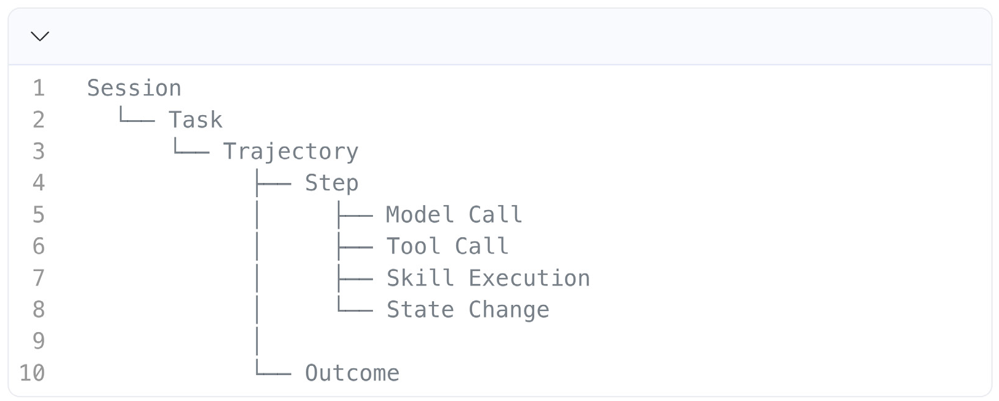

- Session：用户、Agent 或系统围绕一段连续交互建立的上下文容器，用于关联同一会话中的多个任务及其执行过程。
- Task：一次 Agent 执行所要达成的目标及其期望结果，是衡量后续行为与最终效果是否合理的依据。
- Trajectory：一个 Task 中按照时间和因果关系组织起来的完整执行轨迹，记录 Agent 如何从任务目标逐步采取行动并产生结果。
- Step：Trajectory 中一个具有明确语义的原子执行单元，代表 Agent 在某一时刻完成的一次决策、调用、操作或状态变化。
- Model Call：是 Agent 对模型的一次调用，记录模型输入、输出以及模型、Token、延迟等运行信息。
- Tool Call：是 Agent 对外部工具或能力的一次调用，记录调用目标、输入参数、执行结果及运行状态。
- Skill Execution：是 Agent 对一个封装后的可复用能力单元的一次执行，体现该 Skill 在具体任务中的调用上下文、行为和结果。
- State Change：是 Agent 执行过程中对外部环境、记忆、上下文或自身运行状态产生的一次可观测变化。
- Outcome：是一次 Agent 针对 Task 产生的最终结果。

### 3.4.2 架构

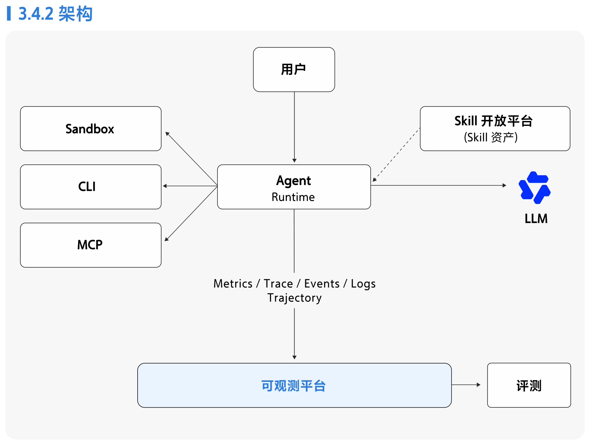

1. **全链路数据采集**：OpenTelemetry GenAI Semantic Conventions 为模型调用、Agent 执行及相关运行时遥测提供了标准化语义基础；Sandbox、Skill、CLI 等外围执行环境可基于统一的 Context Propagation 和扩展语义纳入同一观测链路。ATIF（Agent Trajectory Interchange Format）则定义了跨 Agent 的统一轨迹协议，当前在评测 / 训练场景成为了重要通用交换格式。基于这类规范实现采集数据的标准化有助于让可观测产品最大化适配不同的 Agent 系统。

2. **基于 Trajectory 的行为分析**：从全量 Trajectory 中分析和筛选值得关注的 Trajectory 样本，是评估和优化 Agent 的基础。相比传统基于 OLAP 的 Trace 分析，Trajectory 分析的核心在于语义分析。以级联漏斗实现低成本的全量分析：先以确定性规则全量筛查，再由 LLM 筛出灰区样本，再对灰区样本做意图达成度、推理合理性、工具调用恰当性与检索相关性等维度分析。

3. **可观测与评测的数据共享**：Trajectory 不仅是 Agent 重要的可观测数据，同时也是 Agent 评测的核心数据资产。利用可观测的标准化采集能力为评测提供数据，能够最大化保障评测的数据质量。Trajectory 经用户反馈关联、评估筛选与标注，进入到 Agent 评测系统从而变成帮助 Agent 持续优化效果的数据资产。

4. **Skill Runtime 自动化观测**：通过与 Skill 开放平台及 Skill Runtime 集成，将标准化观测契约封装在 Skill 的执行环境或 SDK 中，使 Skill 能够自动生成执行遥测并继承上游 Agent 的上下文。在不要求业务开发者重复进行观测埋点的前提下，实现 Skill 与 Agent、Task、Trajectory 之间的关联，并兼容 OpenTelemetry 的 Trace Context 传播机制。

# 四、总结

这本手册是我们在 AI Native 研发范式转型过程中的一次阶段性整理，记录的是过去几个月里不同团队在实践中摸索出的经验、遇到的问题，以及形成的一些初步共识。它不是一份成熟的方法论，更谈不上标准答案——很多做法还在验证中，有些方向看得到趋势但尚未跑通。

手册从三个真实案例出发：AIDC 数字投手智能营销助手、干问用增 Agent 和万有无界平台。它们的背景和切入点各不相同，但都指向同一个认识：AI 写代码的能力提升很快，真正制约交付效率的往往是代码之外的环节。基于这些实践，手册提炼了环境与验证驱动、平台能力升级、提效度量、数字员工和组织配套五个共性挑战，并进一步围绕企业级 AI 研发基础设施展开：从 Harness 框架、企业知识库、工具体系，到 Sandbox、Coding 环境、身份与权限、Guardrail 和可观测能力。坦率地说，其中不少内容仍处于建设早期，我们选择将其写出来，更多是为了记录当前的思考框架，而不是呈现一套已经验证完备的方案。

回顾过去几个月，团队的情绪经历了一条明显的曲线：最初模型能力的跃升带来了强烈的兴奋感，不少人认为软件研发很快就能完全托管给 AI；但随着实践深入到真实业务的具体问题，环境搭不起来、上下文拼不全、验证跑不通、发布卡在流程上，大家逐渐从乐观转向务实。这种从兴奋到谨慎的过程，本身也是认知校准的一部分。我们清醒地看到，前方的路远比已经走过的更长，也更有挑战。

**从写代码到可靠交付，仍有较多技术问题要解决。** Agent 在编码环节的能力已经相当可观，但软件交付的最后一公里，构建、集成测试、灰度发布、生产验证、故障恢复，涉及真实环境、真实数据和真实用户，容错空间极小。让 Agent 在这些高风险环节稳定工作，对 Sandbox 隔离、凭证管理、Guardrail 机制和可观测能力都提出了远超当前水平的要求。基础设施本身的工程复杂度，可能不亚于 Agent 应用层的建设。

**企业的知识和资产，还没充分做到 Agent 友好。** 目前大量组织知识仍然散落在文档、口头传递、个人经验和各类内部系统中，即便整理进知识库，也往往停留在“人能查到”的阶段，距离被 Agent 高效检索、准确理解和可靠引用还有很大差距。更进一步，如果希望 Agent 能够在任务中自主积累经验、更新知识、优化自身工作流，也就是某种程度的自进化，那么知识的结构化、版本化、权限管理和质量治理都还有大量工作要做。

**组织设计的影响更为深远，也更难找到确定性答案。** 手册中讨论了岗位合并、超级个体、小团队协作等方向，但诚实地说，行业还远没有走出一条成熟路线。一方面，AI 显著拓宽了个体的能力边界，组织需要新的激励机制来释放这种潜力；另一方面，员工过去赖以立足的许多专业技能正在被快速替代，“蒸馏焦虑”真实存在，当贡献知识可能加速自身被替代时，转型所需的知识沉淀就会遇到阻力。如何在激励创造与缓解焦虑之间找到平衡，是每个管理者都需要面对但目前尚无标准解法的命题。

**最后，AI 技术本身的迭代速度，会对现有架构持续造成冲击。** 过去两年，主流模型几乎每隔数月就有一次能力跃升，SWE-bench Verified 成绩从不足 30% 跳到 80% 左右，新的模型族、新的推理范式和新的交互协议不断涌现。这意味着今天设计的技术架构、工具体系和工作流程，很可能在半年后就需要重新审视。我们必须接受这种不确定性，保持架构的适应弹性，同时避免因为“等更好的模型”而推迟必要的基础设施建设。

这本手册记录的是一个快速变化中的切面。我们相信方向是对的，但走法还在摸索。希望这些经验和思考，哪怕只是提供了一些可以讨论的具体素材，也算是对这个阶段的一点贡献。

<!-- 封底（2026 Handbook 徽标），无正文装饰 -->

回顾过去几个月，模型能力的跃升，一度让团队不少人倍感兴奋，认为软件研发很快就能完全托管给 AI。但随着实践深入到真实业务的具体问题：环境搭不起来、上下文拼不全、验证跑不通、发布卡在流程上——大家逐渐从乐观转向务实。这种从兴奋到谨慎的过程，本身也是认知校准的一部分。我们清醒地看到，前方的路远比已经走过的更长，也更有挑战。

主编：许晓斌

作者：许晓斌、徐星、朱书剑、陈凯成、杨晓敏、张玥、刘键、周志伟、吴佐行、王博格、谭海燕、车正、朱少飞、靳文祥、徐临源、安佳明、李伟、金陈敏、曾逸尘
