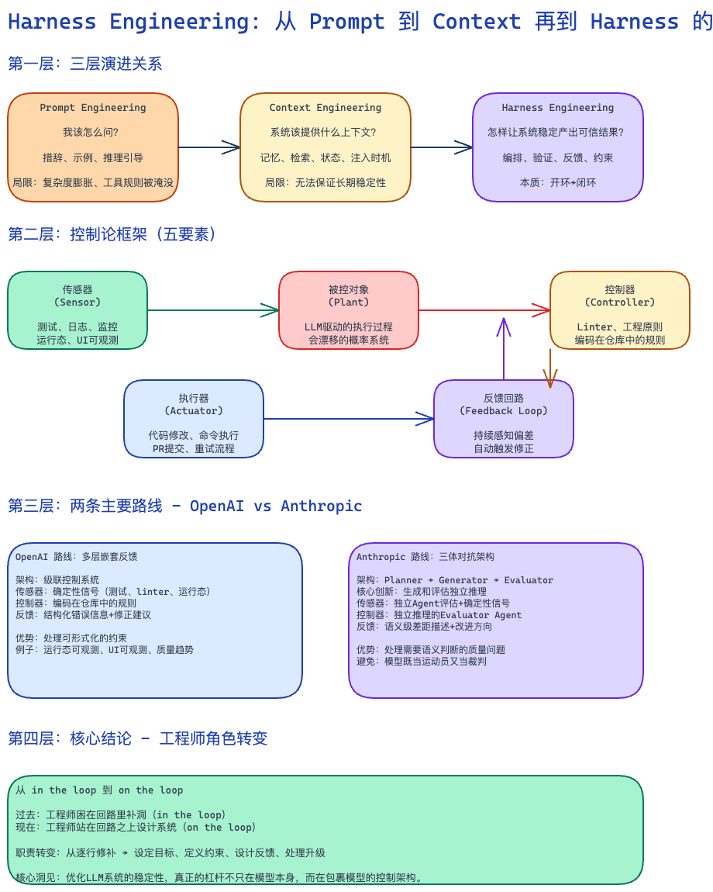

# Harness Engineering 学习笔记：从 Prompt Engineering 到 Context Engineering（简短版）

# Harness Engineering 学习笔记：从 Prompt Engineering 到 Context Engineering

## 一句话总结

Harness Engineering 不是研究"怎么把 prompt 写得更好"，而是研究怎么给大模型套上一整套可观测、可验证、可纠偏的外部控制系统。

## 三层演进

| 层次                  | 核心问题           | 关注点           |
| ------------------- | -------------- | ------------- |
| Prompt Engineering  | 我该怎么问？         | 措辞、示例、推理引导    |
| Context Engineering | 系统该提供什么上下文？    | 记忆、检索、状态、注入时机 |
| Harness Engineering | 怎样让系统稳定产出可信结果？ | 编排、验证、反馈、约束   |

## 为什么需要 Harness Engineering

**Prompt Engineering 的局限**：
- 复杂任务链条下，提示词膨胀成难维护的补丁系统
- 工具调用规则被上下文噪音淹没
- 静态提示无法提供实时状态信息

**Context Engineering 的天花板**：
- 优化的是输入端，而非输出后的纠偏
- 无法保证长期运行中的稳定性
- 模型会漂移、累积错误、在无人值守时退化

**Harness Engineering 的核心洞见**：
> 把大模型当成一个会漂移、会犯错、会自我高估的概率系统，不再指望模型一次就答对，而是通过上下文供给、规则约束、工具执行、状态管理和反馈回路，让系统在长时间运行中持续逼近正确结果。

## 控制论框架

Harness Engineering 的本质是把开环系统改造成闭环系统。

### 开环 vs 闭环

- **开环**：给输入 → 执行 → 结束。没有持续校正机制。
- **闭环**：给输入 → 执行 → 测量偏差 → 修正 → 再执行。系统能自动检测并纠正错误。

### 控制系统五要素

1. **被控对象（Plant）**：LLM 驱动的执行过程本身——一个会漂移的概率系统
2. **传感器（Sensor）**：测试结果、运行日志、工具返回值、监控信号
3. **控制器（Controller）**：编码在仓库中的规则、linter、工程原则
4. **执行器（Actuator）**：代码修改、命令执行、PR 提交
5. **反馈回路（Feedback Loop）**：持续感知偏差、比较目标、修正系统

## OpenAI vs Anthropic 两条路线

| 维度   | OpenAI          | Anthropic                           |
| ---- | --------------- | ----------------------------------- |
| 控制架构 | 多层嵌套反馈回路        | 三体对抗架构（Planner-Generator-Evaluator） |
| 核心假设 | 模型会偏，但可用确定性约束拉回 | 模型会偏且会自我欺骗，必须外部独立评估                 |
| 反馈信号 | 测试、linter、运行态信号 | 独立 Agent 评估 + 语义级差距描述               |

**Anthropic 的关键创新**：把生成者和评估者拆成独立的推理过程，避免模型"既当运动员又当裁判"。

## Superpowers：开源社区的实践标杆

Jesse Vincent 的 Superpowers 项目把 Harness Engineering 思想落地为一套可复用的 Skill 文件：

- **流程冻结**：`Brainstorming → Writing Plans → Execution`，每阶段有硬性关卡
- **两阶段审查**：先检查"做的是不是对的事"，再检查"做得好不好"
- **模型分级**：重模型做架构判断，轻模型做局部实现
- **元控制**：用 TDD for Skills 来约束反馈回路本身

## 我的理解

- Prompt Engineering 是基础能力，Context Engineering 是输入优化，Harness Engineering 是系统架构。
- 三者不是替代关系，而是逐层外扩：Context 是 Harness 的基础层，Harness 是把 Context 变成长期稳定系统能力的上层结构。
- 工程师的角色正在从 in the loop（困在回路里补洞）走向 on the loop（站在回路之上设计系统）。

## 关键结论

> 优化 LLM 系统的稳定性和可靠性，真正的杠杆不只在模型本身，而在包裹模型的控制架构。

## 延伸阅读

- OpenAI: [Harness Engineering: Leveraging Codex in an Agent-First World](https://openai.com/engineering/harness-engineering/) (2026-02)
- Anthropic: [Effective Harnesses for Long-Running Agents](https://www.anthropic.com/research/harnesses) (2025-11)
- [Superpowers Project](https://github.com/vulturkara/superpowers)

[[doc-notes/mocs/AI Coding MOC|AI Coding MOC]]
