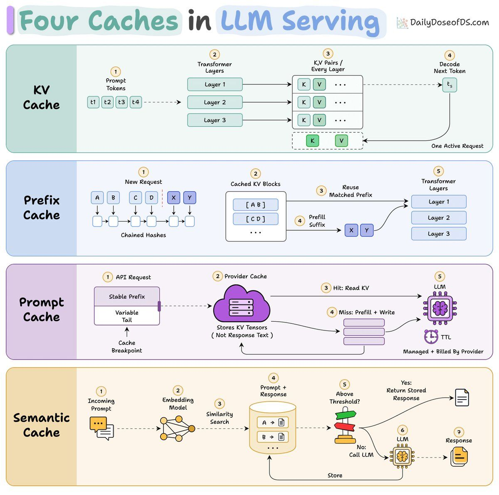

# LLM serving 的四层缓存

Four caches in LLM serving, clearly explained:

Every LLM request reads the whole prompt and computes attention state for every token in it.

This step is called prefill, and it impacts both the input bill and the time before the first token appears.

In an agent loop, most of the prompt comprises text that the model already processed in the previous turn.

There are four cache layers that prevent paying for the processed tokens at each turn.

↳ The KV cache holds the key and value tensors for every token at every layer, for one active request.

↳ Prefix caching keeps those tensors on the server instead. vLLM stores them in 16-token blocks and identifies each block by a hash that chains in the previous block's hash, so a block only matches if everything before it matched too. The scheduler stops at the first miss and prefills the suffix from there.

↳ Prompt caching is the same reuse that runs on a provider's hardware, with a price sheet attached. Anthropic charges 1.25x the base input rate to write an entry and 0.1x to read it.

↳ Semantic caching works differently. It embeds the incoming prompt, runs a similarity search over stored prompts, and returns a stored answer outright when the score is above a threshold.

That's why it saves output tokens as well as input tokens. It's also why every request pays for an embedding round trip, including every miss.

The first three match on exact tokens and cannot change what the model produces.

This technique matches on similarity, which means it is quite susceptible to generating a wrong response since embeddings may match to a wrong prompt.

The diagram below depicts all these techniques.

To use these techniques, you don't need to build a custom serving stack.

The transformers library already implements the cache as an object of KV vectors that you can preserve, so you can prefill a corpus once, retain the returned tensors, and reuse them across queries in about ten lines.

And this KV cache is only one of four separate caching layers in an LLM stack.

The other three are prefix caching on the server, prompt caching billed by a provider, and a semantic cache that skips the model entirely.

We wrote a full breakdown of all four caches in LLM serving that you should know as an AI engineer, with code for each.
